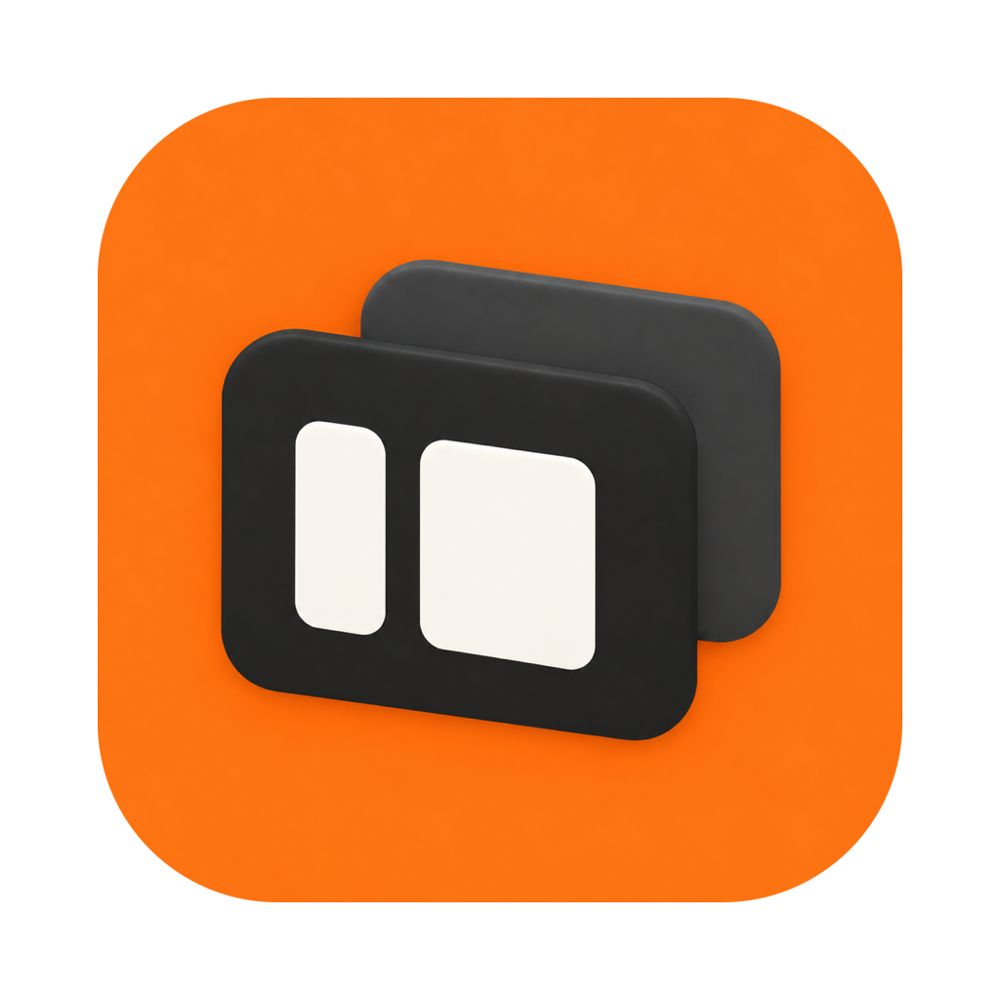

# AgentDeck



AgentDeck 是 Coding Agent 的统一原生桌面客户端。产品目标仍是把 Codex 和
Claude Code 作为一等公民放进同一个工作台；当前实现处于桌面端重启阶段。

## 当前状态

macOS 旧 AppKit 客户端已经移除。新的 `agentdeck-desktop` 使用 Rust、
[GPUI](https://crates.io/crates/gpui) 和
[gpui-component](https://crates.io/crates/gpui-component) 从最小壳开始迭代。

当前桌面端只承诺：

- 创建真实 GPUI macOS 窗口，使用透明标题栏。
- 初始化 `gpui-component` 并挂载 `Root`。
- 渲染外壳布局：全高左侧栏（品牌行 / 快捷入口 / 最近会话 / 本机 Agent 状态）、
  空态（居中标题、圆角 composer、按已注册 agent 生成的接入卡片），以及会话态
  （thread header、会话记录、底部悬浮 composer）。
- **接入本机 `agentdeckd` 的只读历史**：启动时先问 daemon 注册了哪些 agent，再按
  agent 分别拉取会话列表（首批各显示 50 条），谁先返回谁先进侧栏；各来源可点击
  “加载更多”，每次扩展 50 条，数量显示为“已加载”。读完或达到每来源 2,000 条上限时
  明确提示；继续加载或失败时保留已有会话与计数。点击条目按
  `threadId` + `agentKind` 读取该会话的真实记录。助手消息按 Markdown 渲染，代码块带
  语法高亮与复制按钮；用户消息暂保持纯文本，避免注入标签被当作 HTML 吞掉。命令、思考、
  工具、变更默认折叠为一行摘要，单行命令、思考和图片路径也可展开；命令的状态、退出码
  与耗时独立显示，失败标红。Markdown 图片暂显示说明与目标链接／路径，不加载图片。
  工具参数和结果只折叠明确标记的 base64 data URI，普通字符串保留文本展示；单段原文
  仍有 2000 字符上限。加载中、失败和空结果都有明确文案；某个来源失败时保留其他来源
  的会话，并在侧栏显示该来源的错误。
  只读请求中可恢复的传输失败在后台等待 1 秒自动重试一次；daemon 明确返回的错误（含超时）
  直接显示，定位、配置和响应解析错误也不自动重试。失败时提供连接、来源列表或正文的
  重试按钮，加载期间不重复发起同一请求；加载更多失败后重试相同目标数量。
  快速切换时最多执行一个历史读取，只保留最新待查会话；记录文本在后台读取完成时
  转换一次，滚动时复用。会话记录（变高 `list`）和侧栏会话列表（等高
  `uniform_list`）都只渲染可见区域附近的条目，长会话滚动不再逐帧排版全部内容。
  侧栏每条会话带 16px 来源像素图标：Codex 为蓝色宠物
  [Codey](https://learn.chatgpt.com/docs/pets) 的简化版，Claude Code 为暖橙色小螃蟹；
  悬停显示信息卡：标题最多三行，底部显示文件夹名和弱化的完整路径。
  列表中的长标题以省略号显示；Tab 聚焦会话列表后，用上下键移动并自动滚动到目标条目，
  Return 打开会话，Tab / Shift-Tab 离开列表。
- composer 为两行紧凑布局：输入行下方一行显示当前会话的项目、agent 和只读状态，
  两种形态共用草稿；发送和搜索仍禁用。
- 透明标题栏下为红绿灯留出顶部空间，空态与会话态顶部均按系统偏好处理双击；
  打开窗口后 composer 默认聚焦。
- 支持通过 `Command+Q` 或 AgentDeck 菜单中的“退出 AgentDeck”退出应用。
- 提供 `--selfcheck`，验证 GPUI、Metal renderer、隐藏窗口和组件树初始化；该路径
  不连接 daemon，也不触碰本机 vendor 历史。
- 开发者模式在右上角显示 FPS 与上一帧间隔：debug 构建（含 `build_and_run.sh`
  产出的 bundle）默认开启，release 构建设置 `AGENTDECK_DEBUG=1` 开启。GPUI
  按需重绘，只统计真实绘制的帧；空闲时每秒补一帧刷新读数，交互时才是真实帧率。
- 通过统一脚本构建并启动 `dist/AgentDeck.app`，bundle 内自带 `agentdeckd`。

当前明确不包含：

- 启动会话、发送 turn、streaming、审批和 vendor 控制；composer 不发送任何内容。
- 用户消息中注入上下文块（如 `<system-reminder>`）的识别与折叠、会话搜索与按项目分组。
- 远程机器、网络数据源和配对流程。
- 对旧 AppKit 界面或行为的兼容层。

这些能力只按新的纵向切片逐步加入；当前仓库先收敛本地最小闭环。

后端 `agentdeckd` 已有 Codex / Claude Code adapter、history、approval、record 和
diagnostics 等较宽的代码表面。Codex 路径已经落地 protocol v4 的 session-scoped
生命周期切片：规范握手、顺序多轮、原生 turn interrupt、显式 close/wait，以及 Unix
进程组消失与路由清除后的 `SessionClosed`；stdin EOF 会有序关闭并等待 retained session，
无法确认 cleanup 时 daemon 会 poison 并退出。消息事件携带稳定 `itemId`、caller-owned
`turnId` 和 `streaming/completed` 状态；`agentdeck session live` 可在同一 daemon 连接上
执行多轮、取消和关闭，生产事件写入同一个 RunRecord，并关联实际 lifecycle diagnostics。
当前完整度和真实 vendor 验收证据见
[docs/AGENTDECKD_STATUS.md](docs/AGENTDECKD_STATUS.md)。

## 仓库结构

```text
agentdeck-desktop/       Rust/GPUI macOS 客户端（外壳 + daemon 只读历史）
agentdeck-protocol/      AgentDeck 中立 IPC 类型与 schema 事实源
agentdeckd/              Codex / Claude Code adapter daemon
agentdeck-cli/           参考客户端与 E2E 驱动
Sources/AgentDeckMobileCore/  iOS 使用的平台无关 Swift 模型
ios/                     UIKit companion
protocol/                Codex 官方 schema 与 AgentDeck schema 快照
docs/                    架构、诊断、质量规则与计划
```

`agentdeck-desktop` 依赖 `agentdeck-protocol`，并通过自带的 typed local client
（`agentdeck-desktop/src/daemon.rs`）按请求 spawn 一个 `agentdeckd` 子进程走 JSONL
stdin/stdout。依赖方向固定为 `desktop → typed local client → agentdeckd`；UI 不直接
解析 vendor JSON，也不把 daemon 嵌入 GUI 进程，更不依赖 `agentdeck-cli`。
macOS 启动 daemon 前会在子进程恢复信号接收，避免继承 GPUI 后台线程屏蔽的
`SIGCHLD`，导致已退出的版本探测进程仍被判为超时。

## 依赖版本

桌面 P0 固定使用：

```toml
gpui = { version = "=0.2.2", features = ["runtime_shaders"] }
gpui-component = "=0.5.1"
```

`runtime_shaders` 用于避免本地额外安装 Metal Toolchain。依赖通过仓库根目录的
`Cargo.lock` 锁定；不要在没有验证的情况下追 Git main。

Codex schema 已验证基线为 `codex-cli 0.155.0-alpha.16`，完整版本写在
`protocol/CODEX_VERSION.txt`。macOS 自动查找优先探测桌面端的
`/Applications/ChatGPT.app/Contents/Resources/codex`，其次探测 PATH 和常见 CLI
安装位置。历史列表和正文读取跳过不存在的候选，使用首个版本探测成功的 executable；
版本不同只显示 warning 并继续读取。live session 仍跳过不匹配候选，要求精确匹配。
两类操作可能选择不同运行时：历史优先当前桌面端，避免旧 CLI 无法读取新版保存的记录；
live session 涉及发送任务，仍使用经过验证的版本。
执行失败、非法输出、超时或清理失败立即报错。版本探测与 app-server 启动使用
同一个规范化绝对路径。AgentDeck 自身 IPC 为 v5，历史成功回复可携带中立的 warnings。

需要指定某一份运行时时，可设置 `AGENTDECK_CODEX_BIN` 为 Codex 可执行文件的绝对
路径；设置后只使用该路径，错误时不自动回退。离线测试也通过这个入口绑定假程序。
AgentDeck 当前复用本机安装，不自带 Codex。

历史 warning 包含实际版本、路径和已验证版本；桌面来源区显示详情，正文顶部默认一行、
可展开详情，列表请求失败时清除旧 warning 并保留已有列表。CLI 输出到
stderr，成功 stdout JSON 与退出码保持不变。版本不同表示尚未验证，不代表协议一定
不兼容。历史启动、RPC、解码或分页失败仍报错，不返回残缺正文；错误保留方法名、
错误码和实际运行时信息。
无法识别的条目显示“暂不支持的内容”，其余内容仍可阅读。桌面长错误可滚动查看，
修复运行时后可直接点击重试。

## 构建与运行

前置环境：

- macOS 15+
- Rust 1.96+
- Xcode 26 或相应 Command Line Tools

最小开发循环：

```bash
cargo check -p agentdeck-desktop
cargo test -p agentdeck-desktop
cargo run -p agentdeck-desktop -- --selfcheck
./script/build_and_run.sh
./script/build_and_run.sh --verify
```

`script/build_and_run.sh` 是唯一桌面 build/run 入口。它构建
`agentdeck-desktop` 与 `agentdeckd`、装配 `dist/AgentDeck.app`、写入 macOS 15 最低版本并
启动最新产物。桌面按请求启动 bundle 内自带的 `agentdeckd` 读取历史。

macOS 应用图标和侧栏品牌行使用统一的 04C 图标；iOS companion 使用同款满版
AppIcon。正式资源和重新生成 `.icns` 的方式见 [图标资源](assets/brand/README.md)。

Codex 桌面应用里的 Run action 已指向该脚本：

```text
.codex/environments/environment.toml
```

## 测试

```bash
# 新 GPUI 桌面壳
cargo test -p agentdeck-desktop
cargo run -p agentdeck-desktop -- --selfcheck

# iOS 共用 Swift Core
swift test

# 默认离线的 Rust workspace 门禁（含 vendor marker tripwire）
scripts/verify-offline-tests.sh

# 直接运行同一套标准 workspace 测试
env -u AGENTDECK_E2E cargo test --workspace --locked

# 用当前 checkout 构建的 daemon 执行 CLI selfcheck
cargo build --locked \
  -p agentdeckd --bin agentdeckd \
  -p agentdeck-cli --bin agentdeck
AGENTDECK_DAEMON_BIN="$PWD/target/debug/agentdeckd" \
  ./target/debug/agentdeck \
  --data-dir /tmp/agentdeck-selfcheck selfcheck

# 协议 schema 漂移
AGENTDECK_DAEMON_BIN="$PWD/target/debug/agentdeckd" \
  ./target/debug/agentdeck \
  --data-dir /tmp/agentdeck-schema protocol schema \
  | diff - protocol/agentdeck/agentdeck-protocol.schema.json

# 文档结构
scripts/verify-agent-docs.sh
```

只有改动对应层时才运行其门禁。

标准 `cargo test --workspace --locked` 默认不启动 `codex` / `claude`，也不读取用户
vendor history；所有真实 vendor process、session、prompt、history 和 auth 路径只在
`AGENTDECK_E2E` 的值严格等于 `1` 时启用。`scripts/verify-offline-tests.sh` 会把 marker
shim 放到 PATH 首位，并使用临时 HOME 隔离用户 vendor history 与默认 AgentDeck data dir：unset 和 `0` 各跑完整
workspace，空值、`false` 和其他值跑全部 gated integration targets，每次都断言 marker
不存在。普通 Cargo 测试中的 E2E 提前跳过仍会显示 passed，因此该结果不等于真实
Codex / Claude Code E2E 证据；完整边界见 [docs/QUALITY.md](docs/QUALITY.md)。

## 下一条纵向切片

desktop 已经通过 typed local client 接入 daemon 的只读历史，下一步是把写入侧接上，
而不是恢复旧客户端的全部功能：

1. 桌面只读历史已落地（侧栏真实会话列表 + 会话记录），实现与坑点见
   [只读历史接入记录](docs/plans/2026-09-22-desktop-history-readonly-implementation.md)。
   Codex 列表查询包含全部 provider，正文通过稳定分页接口读取；未验证版本仅 warning。
   升级后的真实历史读回和桌面点击验收边界见实施记录；Claude Code 的会话标题常带
   `<local-command-caveat>` 噪声，需在 daemon 侧收敛。
2. 持久 CLI 四轮曾在 0.145.0 的临时配置覆盖环境通过，包含累计 streaming、同 PID/threadId
   复用、取消后继续、回收与记录读回；升级后的 lifecycle E2E 尚未重跑，
   证据见 [M0 CLI 实施记录](docs/plans/2026-09-21-backend-m0-cli-implementation.md)。
3. 在此之上给 desktop 接入会话启动与 turn 流（需要把 one-shot round-trip 换成长连接），
   再增加审批、Markdown 和多 agent 能力。

`agentdeck session live` 的 stdin 接受现有 `ClientCommand` JSONL，stdout 连续输出协议
事件和管理回复。客户端收到 `TurnFinished(nextState=ready)` 后可发送下一条 `TurnStart`；
用 `TurnCancel` 取消当前轮，用 `SessionClose` 关闭会话，stdin EOF 会有序关闭并回收
daemon。该入口使用固定 M0 选项（只读、never approval、medium），完整驱动示例见
`agentdeck-cli/tests/support/live.rs`。

设计和实施边界见：

- `docs/plans/2026-08-17-gpui-desktop-reset-design.md`
- `docs/plans/2026-08-17-gpui-desktop-reset-implementation.md`
- `docs/plans/2026-08-17-codex-app-server-lifecycle-adr.md`
- `docs/plans/2026-08-17-agentdeckd-minimum-stable-boundary-design.md`

## 文档入口

- [ARCHITECTURE.md](ARCHITECTURE.md)：稳定边界与依赖方向。
- [docs/index.md](docs/index.md)：文档导航和历史计划。
- [docs/AGENTDECKD_STATUS.md](docs/AGENTDECKD_STATUS.md)：daemon 能力完整度与缺口。
- [docs/QUALITY.md](docs/QUALITY.md)：按变更范围选择验证。
