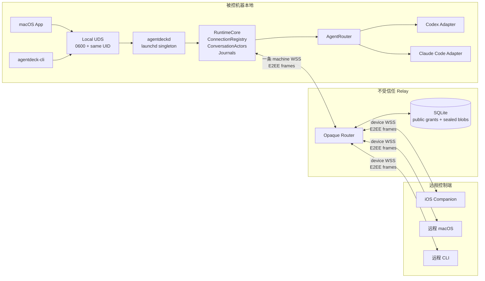

# AgentDeck Relay Companion MVP 端到端设计

| 字段 | 值 |
|---|---|
| 状态 | Approved - 六节设计与书面 spec 已确认（2026-07-10）；实施计划已建立，尚未进入代码实现 |
| 日期 | 2026-07-10 |
| 主题 | 单机单常驻 daemon、多读者/多写者但 daemon 串行裁决、按机器独立配对、Relay 严格最小可见、真实 iOS Companion 的端到端方案 |
| 关联 | `NORTH_STAR.md`、`README.md`、`ARCHITECTURE.md`、`docs/plans/2026-07-01-agentdeck-mobile-relay-design.md`、Relay R0/R1a/R1b 设计与实施文档、`docs/plans/2026-07-03-ios-uikit-frontend-design.md` |
| 后续 | 按 `2026-07-10-relay-companion-mvp-implementation.md` 逐 task 执行；本文继续作为目标架构事实源，不承载逐文件 TDD 步骤 |

## 0. 摘要与文档权威性

本设计把 AgentDeck Relay 从已经落地的 R0/R1a/R1b 骨架推进为一个可真实使用的 **Companion MVP**：一台被控机器只有一个由 `launchd` 管理的常驻 `agentdeckd`；本地 macOS App、CLI、远程 CLI、远程 macOS 和 iOS Companion 都连接到同一 RuntimeCore；多个读者共享 canonical event stream，多个写者由 daemon 按 conversation 串行裁决；Relay 只保存和路由随机 route、序号、时间、大小、在线状态、公钥材料与密文，不能读取机器名、session 元数据、prompt、输出或审批。

本设计是 **Relay 下一阶段的目标架构事实源**。R0/R1a/R1b 文档继续保留，记录当时已经实现的事实、测试和决策过程；凡与本文冲突的目标状态，以本文为准。主要取代项包括：

- 取代 Relay 可读的 `MachineDescriptor` / `SessionDescriptor` / `MachineList` / `SessionList` / `AnnounceSession`。
- 取代 bearer credential 与长期 bootstrap secret。
- 取代“每个 macOS App 私自 spawn 一个 daemon”的进程模型。
- 取代把 `conversation_id` 直接等同 vendor `thread_id` 的身份模型。
- 取代 `CommandDelivered` 被 UI/CLI 当作业务成功的语义。
- 取代生产 TLS 配置失败时回退明文的行为。

本文不宣称当前代码已经具备这些能力；当前代码仍停留在 R1b 及 fixture 驱动 iOS 骨架。实施完成必须满足 §17 的 Definition of Done。

## 1. 背景与当前问题

### 1.1 已有基础

当前仓库已经具备可以复用的基础：

- `agentdeck-protocol/src/remote/` 已有 Relay frame/control/data/fleet 契约和 schema 快照。
- `agentdeck-relay` 已有 WebSocket server、鉴权骨架、SQLite store、事件缓冲、ACK 与重放补拉测试。
- `agentdeck-relay-client` 已有 WS client；CLI 已有 `remote pair/machines/sessions/watch/send` 命令面。
- `agentdeckd` 已有中立的 `AgentRouter`、Codex/Claude Code adapters、统一事件输出和历史接口。
- iOS 已有 UIKit Machine/Session/Inbox/Detail/Pairing 屏幕、`MobileSessionSource` 抽象和 fixture 测试。
- `Sources/AgentDeckCore/` 已能在 macOS/iOS 共享协议模型、reducer 与 presentation。

### 1.2 当前实现不能作为 Companion MVP 的原因

现状审计确认了以下阻塞：

1. Relay 配置了 TLS 但 binary 未编译 TLS feature 时会告警后回退明文；WSS 客户端本身也没有完整 TLS 能力。
2. CLI 配对只保存 bearer 元数据，未保存新生成的签名/box 私钥，现有配对不能形成真实端到端身份。
3. Relay 控制面明文包含机器名、session title、cwd、agent kind 和真实 thread/turn 身份，不满足“严格最小可见”。
4. `DataEnvelope` 只有 `Plaintext`；Relay 虽不主动 decode，但进程和内存仍能读取业务内容。
5. `agentdeckd` 只有单 stdin/stdout owner；macOS App 的 `ProcessDaemonTransport` 私自 spawn daemon，多个客户端不能共享 runtime。
6. CLI `remote send` 的成功只表示 Relay 找到 machine 连接，未证明 daemon 接受或执行命令。
7. Router 的 Heartbeat、Unsubscribe、慢连接隔离、生产撤销、跨重启 replay、任务退出等仍有不完整路径。
8. iOS `MobileSessionSource` 命令无返回错误/回执；ViewModel 乐观写审批状态，并可能重复启动 event subscription。
9. 旧 Relay schema、凭据和 plaintext 路径尚未发布，没有兼容旧行为的产品义务，却会显著增加新设计复杂度。

因此本期不在 R1b 结构上继续局部补丁，而是保留已经证明有效的 WS/SQLite/测试基础，将协议、信任边界和 daemon ownership 一次性收敛为可长期演进的形状。

## 2. 目标与非目标

### 2.1 目标

- 一台被控机器只运行一个常驻 `agentdeckd`，所有本地/远程客户端共享同一 runtime 状态。
- 多读者同时订阅；多写者可同时发命令，但每个 conversation 的 prompt 由 daemon FIFO 串行执行。
- 同一审批只允许第一个有效决定获胜，后到决定得到明确 `AlreadyHandled`。
- 所有有副作用命令具有 daemon 级 idempotency，Relay 回执不能冒充业务成功。
- 每台被控机器是独立信任域；配对邀请由被控机器本地 App/CLI 生成，5 分钟、单次使用。
- Relay 严格最小可见，所有业务目录和内容端到端加密。
- Relay/daemon/iOS 在断线、普通重启、慢连接和有界缓存淘汰后具有明确的恢复语义。
- iOS Companion 通过真实 Relay 链路完成配对、机器/session 浏览、会话流、prompt、审批和前后台恢复。
- Codex 和 Claude Code 都在真链路上作为一等公民完成验收。

### 2.2 非目标

- APNs、后台常驻 WebSocket、后台任务完成通知。
- iOS 离线 transcript 数据库、全文搜索、附件上传。
- 托管 Relay、SaaS、多租户账户、团队/角色 ACL。
- 账户级或云端密钥恢复、escrow、跨机器信任继承。
- Relay 保存或索引 vendor 历史；Codex/Claude Code 原生历史仍是本地事实源。
- 多台已配对机器共用一条 iOS 物理 WSS 的电量优化。
- 为兼容未发布的 Relay v1 wire、bearer 凭据或旧开发 DB 增加双栈。
- 对历史内容提供完整 forward secrecy、持续 post-compromise security 或双棘轮会话恢复。
- 通过 padding、混淆或 cover traffic 隐藏 frame 大小、频率、在线时间和通信关系。
- 在 endpoint OS、Keychain 或已配对设备已经被完全攻陷后继续保证该 endpoint 的机密性。
- Linux 上持久保存远程控制端设备私钥；MVP 的持久远程 CLI 仅支持 macOS Keychain。

### 2.3 威胁模型与信任假设

MVP 把 Relay 和路径网络都视为主动不可信，而不是只防止“管理员误看数据库”：

- Relay 可以永久记录、丢弃、延迟、重排、重复、替换 frame，可以把多个连接的元数据关联起来，也可能与一个已配对设备串谋。
- 公网、反向代理和中间网络可以主动劫持连接；TLS 必须先建立服务端身份，E2EE 再保护业务内容。
- 已配对但被攻陷的设备可以读取它在撤销前获准看到的内容，也可以在其 grant 权限内发命令；它不能伪造 daemon 的 canonical catalog/event，因为 daemon 下行另有 `MachineDataSign` 签名。
- 被控机器 OS、daemon 进程、Apple Keychain/Secure Enclave 边界和用户确认配对时看到的本地 UI 被视为可信。若这些 endpoint 边界失守，MVP 不承诺继续保密。
- 完整 PairInvite 是 256-bit bearer authorization。二维码、SSH 复制或其他带外传递必须由用户保证真实性和机密性；截获者可以抢先尝试消费邀请，因此 UI 必须在本机显示待配对设备指纹并允许用户取消。

“严格最小可见”仍会向 Relay 暴露以下传输元数据，MVP 明确接受且不做 padding：

| Relay 可见 | Relay 不可见 |
|---|---|
| 随机 machine/device/stream/request route 及它们的连接图 | 机器名、项目路径、session title、agent kind |
| 订阅数量、frame family、方向、stream sequence | conversation/thread/turn/command/approval 的真实业务 ID |
| Relay 接收时间、密文字节数、连接在线与重连节奏 | prompt、output、tool call、审批决定、history/snapshot 明文 |
| grant/link 的公开验签材料、serial/generation、撤销状态 | DeviceAuthorization、业务权限、对称 key 与 vendor resume reference |

攻击者仍可做流量分析；本文中的 E2EE/严格最小可见不应被解释为匿名通信或不可观察性。

## 3. 已确认的产品决策

1. 交付范围是 **端到端 Companion MVP**，不是只完成 R1c crypto spike。
2. 每台被控机器只有一个常驻 daemon；本地和远程都进入它。
3. 并发模型是“多读者、多写者，但 daemon 串行裁决”。
4. prompt 按 conversation FIFO；不同 conversation 可以并行。
5. 审批第一个有效决定获胜；后到决定返回 `AlreadyHandled`。
6. Relay 采用“严格最小可见”，只理解通用 opaque route/stream/request 语义。
7. 信任域按被控机器独立；同一 iPhone 配对两台机器时拥有两套独立身份与 grant。
8. PairInvite 必须由被控机器本地 App/CLI 创建；Relay 管理员不能替机器批准设备。
9. PairInvite 5 分钟、单次；MachineRoot/Keychain 丢失后不恢复，执行 trust reset 并重新配对。
10. 采用“canonical daemon + encrypted relay message bus”，拒绝每客户端独立 tunnel/runtime 和 gateway sidecar。
11. 普通 daemon/Relay 重启保留配对；只有显式 trust reset 或 MachineRoot 丢失才重配。
12. iOS MVP 前台在线、后台暂停，不把 APNs 偷渡进本期。

## 4. 核心不变量

实现和测试必须新增并守住以下不变量：

- **RC-1 单一所有权**：被控机器的 session catalog、命令顺序、审批状态、event sequence 和 idempotency 只由该机唯一 RuntimeCore 拥有。
- **RC-2 传输平权**：本地 UDS 与 RemoteLink 只负责认证、编解码和收发；进入 RuntimeCore 后没有“本地优先”或“远程特权”。
- **RC-3 每会话串行**：同一 conversation 最多一个 active turn；prompt FIFO；控制通道可优先处理 approval/cancel。
- **RC-4 先持久化后接受**：daemon 在 command journal 事务提交前不能返回 `Accepted`；Relay 对需要持久化的 Publish/enroll/revoke 在事务提交前不能回成功或扇出。在线 `Send/Reply` 不做 Relay 离线队列，其回执只表示已经进入当前 active writer。
- **RC-5 业务成功只来自 daemon**：Relay 的 `RouteAccepted` 永远不是 command success。
- **RC-6 Relay 零业务目录**：Relay schema、wire 和日志中不存在机器名、session title、cwd、agent kind、vendor thread/turn ID 或业务内容。
- **RC-7 加密强制**：生产 Relay v2 不接受 plaintext data envelope；非 loopback 传输必须 TLS fail-closed。
- **RC-8 按机器信任**：DeviceGrant 由 MachineRoot 签发；其中 RelayGrant 只供 Relay 验签，encrypted DeviceAuthorization 只供 endpoint 执行业务权限。Relay 不能创建或扩权。
- **RC-9 稳定中立身份**：`conversationId` 由 daemon 在 adapter 启动前生成；vendor resume handle 只能作为 adapter 私有 opaque state。
- **RC-10 有界资源**：所有 socket writer、prompt queue、Relay frame retention、磁盘使用和匿名 pairing/challenge 都有 count/bytes/time 上界。
- **RC-11 无静默丢失**：gap、lag、revoked、interrupted、queue full、store failure 和 incompatible version 必须成为可观察状态或 failure code。
- **RC-12 平台边界**：`AgentDeckCore` 继续不 import UIKit/AppKit/CryptoKit/网络；共享网络与 crypto 放入独立 Swift target。
- **RC-13 vendor 隔离**：Codex/CC resume/state 细节继续分别留在 `agentdeckd/src/codex/` 与 `agentdeckd/src/claude_code/`。
- **RC-14 无 vendor token**：daemon、Relay、Swift client 都不读取、保存或转发 Codex/Claude Code token。
- **RC-15 daemon 来源真实性**：所有 daemon→device catalog/event/snapshot/key update 都由 root-certified `MachineDataSign` 签名；共享对称 key 只提供机密性与成员访问控制，不能替代发送方签名。
- **RC-16 能力先行**：snapshot、history import 和 backfill 必须先交付 `SessionCapabilities`，再交付任何 `AgentItem`；远程链路不能绕过现有 N7。

## 5. 总体架构



### 5.1 被控机器

- 产品语义中的“唯一 daemon”是：每个登录用户/被控机器只有一个 **stable、remote-enabled** 的生产实例。`launchd` 以 `com.agentdeck.agentdeckd` LaunchAgent 维持它，daemon 自身再持有 stable namespace 进程锁，防止手工启动第二实例。MVP 把一个 macOS 登录用户 profile 定义为一台逻辑被控机器；同一物理 Mac 的不同 OS 用户是互相隔离的机器信任域，不能共享 vendor runtime。
- macOS App 从 `ProcessDaemonTransport` 切换为 `UnixSocketDaemonTransport`；退出 App 不关闭 daemon 或 vendor child。
- CLI 默认也连接 UDS。stdio 只保留为迁移/测试 transport，不是生产 ownership 模型。
- daemon 与 Relay 维持一条 machine WSS，复用多个 remote device 和 stream route。
- dev/test 只允许显式 `--ephemeral --no-remote` 实例：使用临时或 `.dev` DB/UDS/Keychain namespace，不注册 LaunchAgent、不连接生产 socket、不读取生产 MachineRoot，也不能成为真实远程被控端。它可以与 stable daemon 共存，但只是测试 harness，不构成第二个产品 daemon。
- stable UDS 固定为 `~/Library/Application Support/AgentDeck/agentdeckd.sock`；Runtime DB、锁和 Keychain access group 都使用 stable namespace。测试实例必须把上述四类资源全部隔离，继续满足现有 K6。

安装与升级固定为：

1. macOS App bundle 携带经过同一发布签名的 daemon helper，并通过 `agentdeck-cli daemon install`（或等价 App 安装入口）复制到 `~/Library/Application Support/AgentDeck/bin/<version>/agentdeckd`。
2. 安装器完整校验签名/版本后原子更新 `bin/current`，生成 `~/Library/LaunchAgents/com.agentdeck.agentdeckd.plist`，再对当前 GUI user 执行 `launchctl bootstrap/kickstart`。
3. active turn 存在时只 stage 新版本；daemon 空闲或下一次明确重启才切换。客户端与 daemon 协议不兼容时显示 typed mismatch，不静默 spawn 私有旧 daemon。
4. `agentdeck-cli daemon uninstall` 卸载 LaunchAgent 并删除已安装 binary/plist，但默认保留 Runtime DB 与 Keychain；只有显式 `--purge` 才进入 trust-reset/purge 流程，不能边卸载边遗留可连接的旧 machine route。

### 5.2 Relay

- 接收 machine/device/pairing 三类连接。
- 验证 MachineRoot/link cert/DeviceGrant 和 challenge signature。
- 按随机 route/stream/request ID 路由、持久化密文、处理 ACK/gap/配额/在线状态。
- 不知道任何 machine/session/conversation 的业务含义。

### 5.3 远程客户端

- 每个 paired machine 是一条独立逻辑 `MachineConnection`。
- 客户端本地保存 paired machine 记录和 keys；“机器列表”不从 Relay 明文 fleet API 获取。
- 目录、会话、事件和命令都在与 daemon 的 E2EE 通道中流转。

## 6. 机器登记、配对与设备授权

### 6.1 Relay 机器登记

长期 bootstrap secret 被替换为 Relay 本机管理员创建的短期 enrollment bundle：

1. Relay 管理员通过本机 admin Unix socket/CLI 运行 `machine-enroll create`。
2. Relay 创建 256-bit 随机 code，仅存 hash，TTL 5 分钟，单次消费；CLI 输出 `wssURL`、code、随机 `relayServerId`、当前/下一张证书的 `SHA-256(DER SPKI)` pinset 和 expiry。完整 bundle 通过用户控制的带外通道送到被控机器。
3. daemon 在发送 code 或任何 MachineRoot 公钥前，先按公开 CA 或 bundle pinset 完成 TLS 服务端验证；禁止 HTTP/WebSocket redirect、host 切换和 `wss://`→`ws://` 降级。
4. daemon 首次启动时在 Keychain 生成 MachineRoot、MachineHPKE、可轮换 MachineLinkSign、可轮换 MachineDataSign 和本地 StorageKEK。
5. daemon 用 code 注册随机 `machineRouteId`、MachineRoot 验签公钥、root-signed link cert 与 data-sign cert。
6. code 消费与 machine row insert 在一个 SQLite 事务中完成；并发消费只能有一个成功。

Relay 机器登记只允许一个新随机 route 上线，不赋予任何设备控制权。

### 6.2 被控机器创建 PairInvite

本地 App/CLI 向 daemon 请求创建邀请。daemon 生成：

- 随机 `pairRouteId`。
- 256-bit invite secret。
- 临时 HPKE receiver keypair。
- Relay URL、`relayServerId`、当前/下一 SPKI pinset、协议版本和过期时间。
- MachineRoot public key/fingerprint 与当前 root-signed MachineDataSign cert，供设备在收到 PairResponse 前建立机器真实性锚点。
- 仅供人识别的机器显示名；它存在于带外邀请中，不进入 Relay 明文。

daemon 必须先向 Relay 发送带 absolute invite expiry 的 `OpenPairRoute` 并收到 ACK，才把邀请返回给本地 App/CLI；打开失败时不得交付一个不可用邀请。同一 machine、`pairRouteId` 与 absolute expiry 的 Open 是幂等重试，不同 owner 或 expiry 必须冲突拒绝。未过期邀请及其 route 状态用 StorageKEK 加密持久化，daemon 或 Relay 重启后复用同一 `pairRouteId` 重新打开，而不是生成第二份邀请。邀请 delivered、expired 或本地取消后，daemon 把 `ClosePairRoute` 放入 durable terminal outbox；只有收到 `Closed/AlreadyAbsent` ACK 才清除本地临时材料。Close 对同一 owner/route 幂等，active route 的不同 owner 一律拒绝。

邀请使用 QR、`agentdeck-pair:v1:<base64url>` 或完整文本传给 iPhone/远程客户端；SSH 复制是合法的带外方式。完整 invite 的持有只是发起本次配对的 bearer authorization，不能在公开聊天或日志中传播；它不绕过被控机器上的设备指纹确认。daemon 以 StorageKEK 加密邀请私钥、secret、PairRequest 与消费状态并放入有界临时表；5 分钟过期后安全删除。

### 6.3 PairRequest 与 DeviceGrant

1. 设备为这台机器生成独立的 `DeviceSign` 和 `DeviceHPKE` keypair。
2. 设备使用 HPKE Base mode 向邀请临时公钥封装 PairRequest，内部包含 invite secret、设备公钥和设备加密授权请求；同时用 DeviceSign 对完整 invite transcript、HPKE `enc` 与 ciphertext hash 做 possession proof。
3. Relay 只按 `pairRouteId` 转发密文，不能读取 secret 或设备信息。
4. daemon 解密、验证 invite 与 DeviceSign proof，并以 compare-and-swap 将 invite 从 `unused` 改为 `preparing(requestHash, frozenRequest)`；随后持久化 `awaitingLocalConfirmation(requestHash, deviceFingerprint, frozenRequest)`，只向 same-UID UDS 的 `LocalPrincipal` 发出待确认事件。远端此时只能取得与 requestHash 绑定的 encrypted/signed `PairPending`，不能得到 grant。
5. 被控机器本地 App/CLI 显示设备指纹并明确确认或取消。只有 `LocalPrincipal` 可以调用 confirm/cancel；任何 `RemotePrincipal`、PairingAccess 或 Relay 管理员都无权批准。多个本地 App/CLI 的 confirm、cancel 与 expiry 在 `awaitingLocalConfirmation` 上执行 first-valid compare-and-swap：赢家得到持久化 canonical `PairingReceipt`，同动作重试幂等重放，冲突方收到 `AlreadyHandled(winner, state)`。confirm 赢后状态进入 `grantPreparing(frozenGrantArtifacts)`，从此 DeviceGrant、device route/serial 和待加密响应内容冻结，cancel/expiry 不得逆转；cancel 或 expiry 赢则绝不签发 grant，并关闭 PairRoute。
6. MachineRoot 签发 DeviceGrant：最小 `RelayGrant` + encrypted `DeviceAuthorization`。
7. daemon 通过 machine-authenticated `InstallGrant(rootSignedGrant)` 注册公开 RelayGrant；Relay 验 root signature 与 serial/hash 单调性，事务提交后返回 `GrantCommitted(serial, grantHash)`。
8. daemon 收到 commit 后才把状态推进到 `grantCommitted(requestHash, encryptedResponse)`，再向设备返回由 MachineDataSign 签名、以 DeviceHPKE 加密的 DeviceGrant 与 machine key directory。崩溃在 commit 前则对同 request 继续同一份 InstallGrant；崩溃在 commit 后则重发同一 encryptedResponse。
9. 设备把 pending keys、DeviceGrant 和 PairedMachineRecord 原子提升为 paired 状态，然后在 PairRoute 上发送 DeviceSign-signed `PairResponseReceived(requestHash, grantHash, responseHash)`；daemon 验签并匹配 frozen response 后才进入 delivered，再关闭 PairRoute，随后设备通过 challenge-response 正式连接。回执丢失时 daemon 保持 grantCommitted 并对同 request 逐字节重发响应；不能把 Relay writer enqueue/flush 的 `RouteAccepted` 当作 delivered。TTL 到期仍无有效回执时必须撤销 orphan grant。

`RelayGrant` 只包含 Relay 鉴权所需字段：随机 machine/device route、设备连接验签公钥、grant serial 和 MachineRoot 签名。`DeviceAuthorization` 绑定同一 grant serial、设备 HPKE 公钥、能力和业务权限，并由 MachineRoot 签名后加密；Relay 只能看到前者。两者合称 DeviceGrant。

DeviceGrant 默认不自动过期，直到被撤销、用更高 serial 更新或 machine trust reset；这样普通长时间离线不会制造不必要的重配。grant renewal 会产生新 serial，也会产生新的 `RemotePrincipal`，旧 serial 进入 tombstone，不能重新上线覆盖新 principal。

PairInvite 一旦进入 preparing 就不恢复为 unused。完整状态机是 `routeOpening → unused → preparing(requestHash, frozenRequest) → awaitingLocalConfirmation → grantPreparing(frozenGrantArtifacts) → grantCommitted(encryptedResponse) → delivered | expired | canceled`。完全相同的 `requestHash` 在 TTL 内可以查询同一 pending 状态、续做同一份 InstallGrant 或幂等取回同一份 `encryptedResponse`；相同 invite 上任何不同 request 都拒绝。daemon 重启后恢复同一状态并重新打开同一未过期 PairRoute，不重复弹出不同请求，也不签出第二份 grant。只有有效 `PairResponseReceived` 才能把 grantCommitted 推进为 delivered。TTL 结束仍未完成时，本次邀请失效并要求重新生成；已经 committed 的 grant 同时进入本机/Relay revoke 清理队列，不能遗留孤儿授权。delivered、expired、canceled 都先持久化 terminal close outbox，等 Relay Close ACK 后再清除邀请密钥/状态。

### 6.4 连接鉴权

- Relay 每次连接生成 32-byte challenge nonce，TTL 30 秒、单次、仅内存保存。
- MachineLink 用 root-signed MachineLinkSign key 签 challenge；日常连接不直接频繁使用 MachineRoot 私钥。
- DeviceLink 提交 RelayGrant 并用其中绑定的 DeviceSign key 签 challenge。
- 签名必须绑定 challenge、connection instance、`relayServerId`、Relay protocol version、目标 route、grant/link serial 与证书 hash，避免跨连接或跨 Relay 重放。
- 同一 machine route 和同一 device route 都只允许一个 active generation；新鉴权连接原子替换旧连接并关闭旧 writer。持久 subscription/ACK 仍按 device route 保存，active writer 始终无歧义。
- Relay 只接受比持久化最高值更高的 link generation 或 grant serial；同 serial/generation 只有完整对象 hash 相同才作为幂等重试，较低值或同值不同内容全部拒绝。

### 6.5 撤销与 trust reset

- 本机 daemon 是 device revoke 权威。它以 MachineRoot 签 `DeviceRevocation`。
- daemon 先在本机 auth ledger 将对应 `grantSerial` 标记 revoked，再持久化待投递的 MachineRoot-signed DeviceRevocation。
- Relay 接收后持久化 `revoked_at` 与 revoke tombstone（主键包含 `grantSerial`），再停止该 device generation 的入站处理，并拒绝后续 challenge。
- revocation COMMIT 时必须丢弃该 generation 尚未写出的普通 writer queue；daemon 对每个 remote RuntimeRequest 再按 `grantSerial` 校验本机 auth ledger，确保“提交前已在网络队列、提交后才到 daemon”的旧 frame 不能执行。
- 本机 revoke 事务同时把该 principal 已 Accepted 但未 Started 的命令终止为 `RevokedBeforeStart`；已 Started 的 vendor action 不能假装撤回，继续按正常结果或由其他授权端显式 cancel。该 principal 已经赢得的 approval claim 不被改判，后续 delivery 由 daemon 承担。
- Relay 不可达时 daemon 仍已阻断该 principal 并轮换 keys；后台任务持续重试 revocation，直到 Relay COMMIT/ACK。device route 与 grant serial 永不复用，Relay 保留 revoke tombstone 到 machine purge。
- daemon 随即轮换 catalog 和所有 active conversation key epochs，向剩余设备重新分发。
- 对 `revokeSelf`，Relay COMMIT 后先丢普通 queue，再从保留的 control slot 向该连接发送包含 MachineRoot-signed `DeviceRevocation` 的 `RevocationCommitted` terminal frame；flush 成功或最多 2 秒后关闭连接。若 terminal frame 丢失，设备再次鉴权会收到同一份 signed revoked terminal state，而不是模糊的网络错误。
- iOS 只允许 revoke self；管理其他设备由被控机器本地 App/CLI 完成。
- 普通 daemon/Relay 重启不需要重新配对。
- 显式 trust reset 且 MachineRoot 尚在时：先签包含 `rootKeyId` 的 `RetireMachine`，等 Relay 返回严格最小的 `RetirementCommitted(machineRoute, trustEpoch, retireHash)` 并读回旧 route 不存在，再删除本机 root/runtime crypto state，最后登记新 route。ACK 丢失时，旧 exact MachineLink challenge proof只重放同一 terminal，不重新激活 route。
- daemon 在 Runtime DB 保存不含私钥的 `MachineEnrollmentReceipt(relayServerId, oldRoute, rootFingerprint)`，用于 Keychain 丢失后的定位；它不是恢复凭据。
- MachineRoot 意外丢失时 daemon remote mode 必须保持 blocked；Relay 操作者通过本地 0600 admin Unix socket 执行 `machine purge <oldRoute> --confirm <rootFingerprint>` 并读回确认后，机器才能建立新 route。若连本机 receipt 也丢失，Relay admin 只能从本地 inventory 列出 route/root fingerprints 由操作者人工确认；无法访问 Relay 管理面时不能安全重新登记。
- purge 事务删除该 machine 的 grants、subscriptions、frames 与 active route material，只保留不可重新激活的最小 retired tombstone；读回必须证明 active route/data 已不存在，再允许 daemon 删除本地 keys/state 并重新 enroll。
- 不提供云端恢复、escrow 或旧 ciphertext 解密恢复。

### 6.6 签名对象与单调版本

所有 root-signed cert/grant/revocation 和 endpoint-signed frame 都使用确定性、长度前缀的二进制 `ToBeSignedV1`，不依赖 JSON canonicalization。公共前缀固定包含：

- domain separator、对象类型、签名格式版本、Relay/Runtime/E2EE protocol version。
- `relayServerId`、machine route、可选 device/stream/request route、可选 stream generation/cursor。
- role/scope、签名公钥 fingerprint、root key ID、machine trust epoch。
- grant serial 或 link/data-key generation、有效期、被签对象 canonical bytes 的 SHA-256。

MachineRoot 只签 MachineLink cert、MachineDataSign cert、RelayGrant、DeviceAuthorization、DeviceRevocation 与 RetireMachine。MachineDataSign 签 daemon 下行 data/key-update；DeviceSign 签设备上行 RuntimeRequest 与 pairing possession proof。MachineRoot 公钥及 root key ID 构成 machine trust anchor；更换 root 必须走 trust reset，不能用普通 key rotation 偷换。

Relay 为每个 machine route 持久化最高 trust epoch/link generation，为每个 device route 持久化最高 grant serial 和 tombstone；回退值永远拒绝。设备同样持久化最高 root trust epoch、MachineDataSign generation 和 key-directory revision，任何回退都作为 rollback/security error。

trust epoch、link/data generation、grant serial 和 key-directory revision 都是各自 authority 分配的无符号 64-bit 单调整数；达到上界必须 trust reset，不能 wrap。route、root key ID 和 stream generation ID 使用 128-bit 随机值且永不复用，不能拿随机 ID 做大小比较。

## 7. 密码学与密钥层级

### 7.1 固定算法

- 身份签名：Ed25519。
- key wrap / pairing：RFC 9180 HPKE **Base mode**，suite 为 X25519 + HKDF-SHA256 + ChaCha20-Poly1305；发送方身份由下面定义的 Ed25519 外部签名提供，不依赖平台特有 Auth mode。
- 高频内容：RFC 8439 ChaCha20-Poly1305。
- 传输：WSS/TLS；E2EE 不是 TLS 的替代，而是把 Relay 排除在内容信任域外。

Rust 使用成熟 HPKE/AEAD crate；Apple 平台使用 CryptoKit 的 `HPKE.Ciphersuite.Curve25519_SHA256_ChachaPoly` 与 ChaChaPoly。禁止手写 X25519/HKDF box 或依赖与 CryptoKit nonce/layout 不一致的 NaCl `crypto_box` wire；双方仍必须以同一批 wire vectors 验证 `enc/info/AAD/ciphertext` 的逐字节互通。

### 7.2 密钥层级

daemon Keychain：

- `MachineRootSign`：只签 link/data cert、grant、authorization、revocation 和 retire。
- `MachineHPKE`：接收设备方向的 key envelope。
- `MachineLinkSign`：日常 Relay connection auth，可轮换。
- `MachineDataSign`：daemon→device canonical data/key update 来源签名，可轮换且证书由 MachineRoot 签发。
- `StorageKEK`：只在本机包装 Runtime DB 中的 DEK、设备 HPKE 目录、counter/replay state 和短期 pairing state；不离开 Keychain。
- `CounterGuard`：每个 active key 的 crash-safe 已预留 counter high-water 与 key-directory high-water，作为检测 DB 回滚的本机锚点。

设备 Keychain（每台 paired machine 独立）：

- `DeviceSign`：Relay connection auth。
- `DeviceHPKE`：接收 daemon key envelopes。
- `RelayGrant`、解密后的 DeviceAuthorization、root/data-sign cert、设备 StorageKEK 与发送 counter guard。

设备本地 `CryptoStateStore`：使用设备 StorageKEK 包装 key directory、stream cursor、key/revision epoch、尚未完成的 counter block 和 receive replay tuple/window；文件启用平台最强 data protection 且排除备份。它不保存解密 transcript，删除 paired machine 时与 Keychain material 一起清理。

高频对称 keys：

- `CatalogKey(epoch)`：机器/session catalog 与状态快照。
- `ConversationDEK(stream, epoch)`：每 conversation 的 daemon→device canonical events。
- `DeviceCommandTxKey(device, epoch)`：单设备、device→daemon 命令通道。
- `DeviceReplyTxKey(device, epoch)`：单设备、daemon→device reply 通道。

HPKE 只封装这些小型 keys；事件/命令内容使用对称 AEAD。每个对称 key 只有一个发送方向。新增或撤销设备时轮换 catalog 与 active conversation epoch。新设备不取得旧 epoch；需要历史时由 daemon 以当前 epoch 重新生成 snapshot/history。

所有 key directory/update 都有 MachineDataSign 签名和单调 `keyDirectoryRevision`。成员变化时 daemon 在每个 active stream 记录 `EpochBarrier(streamGeneration, streamCursor=C, eventSeq=H, oldEpoch, newEpoch, keyDirectoryRevision)`：剩余设备从 `next(C)` 使用新 key；新设备的 subscription 从同一 generation/cursor C 接续，先取得以该设备 `DeviceReplyTxKey` 加密的 snapshot，再接共享 `ConversationDEK(newEpoch)` 保护的 `next(C)`。其中 `next(BeforeFirst)=0`、`next(At(n))=n+1`。Relay 不向新设备重放 barrier 之前的旧-key frames。

设备看到已签名的未知更高 epoch/revision 时暂停应用该 stream，发起有界 `KeySync`（最多 3 次、总计 30 秒），不能立刻把正常 key rotation 当作攻击隔离；低于本地最高 revision、签名无效或超出重试窗口才进入 security error。

### 7.3 Encrypted envelope

Relay 可见 `OpaqueRouteFrame` 仅保留：

- `relayProtocolVersion`、`frameKind`。
- 随机 machine/device/stream/request route IDs。
- Publish 的独立 `streamSeq`。
- 一段 canonical `sealedBlob` bytes。

`receivedAt` 与 `size` 由 Relay 从实际接收结果计算，不由 sender 声明，也不是加密安全前提。`sealedBlob` 对 Relay 是不可解析字段；endpoint 的 E2EE codec 才解析其中的 E2EE format、key ID/epoch、counter/nonce、key-directory revision、ciphertext 与 endpoint signature。Relay SQLite 必须原样保存完整 canonical blob，不能只留 ciphertext 或把 crypto header 拆成可解释列。

Relay v2 的生产 WebSocket outer frame 使用固定、长度前缀的二进制 codec（magic/version/kind/typed fields），`sealedBlob` 直接作为 bytes 携带；不使用 JSON base64 承载生产数据帧。这样 3.5 MiB transfer part 加上 AEAD/outer overhead 后仍可落在 4 MiB WebSocket message 硬上限内。Runtime UDS 与本机 admin socket 仍可使用各自有界 JSONL framing；binary codec 不参与签名 canonicalization，TBS/AAD 继续使用本节定义的独立确定性编码。

业务 payload 全部在 `SealedPayload` 中，包括机器名、session title/cwd、agent kind、prompt、输出、tool call、审批和 daemon 业务 failure。真实 vendor resume reference **永不进入任何客户端 wire**，即使加密也不允许。

daemon 下行 `sealedBlob` 使用 MachineDataSign 对以下 TBS 签名：domain separator、outer machine/device/stream/request route、outer stream generation + streamSeq/cursor（若有）、key epoch、inner version 与 encrypted-section SHA-256。设备上行命令使用 DeviceSign 对等价 TBS 签名。接收端必须先验证 trust/serial/revision，再校验签名、AEAD 与 inner schema；Relay 的 publisher role gate 只是 DoS/路由防线，不是真实性根。

### 7.4 nonce 与 AAD

- 每个对称发送 key 只有一个发送者方向。
- nonce 为 32-bit 随机 key prefix + 64-bit sender counter。
- sender 以 block（默认 1,024 个）预留 counter。预留时先原子提升 Keychain `CounterGuard`，再在 Runtime DB/设备本地状态写入可消费区间；任一步失败都不得使用该 block。崩溃恢复从 Keychain high-water 之后申请新 block，允许跳号但不允许复用。counter 接近上界时强制新 epoch。
- AAD v1 使用固定、长度前缀的二进制编码，不依赖 JSON canonicalization。
- AEAD AAD 绑定 generic frame purpose、随机 route IDs、stream generation + sequence/cursor、request/message ID、key epoch、sender counter 和 inner protocol version。
- HPKE 不共享一份“所有阶段都有”的 info。`PairRequestInfoV1` 固定包含 domain、E2EE/Runtime version、relayServerId、pairRoute、inviteHash、expiry；此时不包含尚未分配的 device route/grant serial。
- `PairResponseInfoV1` 固定包含上述 trust domain、pairRoute、inviteHash、requestHash、已分配 machine/device route、grant serial 与 root trust epoch。
- `KeyUpdateInfoV1` 固定包含 trust domain、machine/device route、grant serial、root trust epoch、key-directory revision、key purpose 与 key epoch。
- 三者的 AAD 都使用 `OuterContextV1`：只编码在 seal 前已经存在的 frame kind、route、stream generation/cursor、request ID 和 version；明确排除 sealed ciphertext、signature、hash 字段自身，避免循环 preimage。PairResponse/key update 的 `enc + ciphertext + infoHash + aadHash` 必须有 MachineDataSign/Root 签名；PairRequest 则有 DeviceSign possession proof。
- 不把 Relay 在接收后才生成的状态当作加密前提；daemon-owned `streamSeq` 可绑定，Relay 时间不可用于安全决策。
- Rust 与 CryptoKit 必须共同验证提交到仓库的 deterministic golden vectors。

Runtime DB 中的对称 key、设备 HPKE 公钥目录、key-directory revision、发送 counter block 与接收 replay state 全部用 StorageKEK 包装后落盘。启动时若 DB 的 epoch/revision/counter state 落后于 Keychain guard，视为备份回滚：旧 epoch 立即退休并重新分发 key；若无法安全协调剩余设备，remote mode fail-closed 并要求 trust reset，绝不猜测 counter 后继续发送。

### 7.5 解密失败

接收端为每个 key 持久化 `highWater + 4,096-entry counter→ciphertextHash sliding window/bitmap`，并区分：

- 完全相同三元组：合法 Relay 重放或传输重试，幂等丢弃但可重放原 receipt。
- 相同 `(keyId, counter)`、不同 ciphertext hash：nonce misuse/tamper，立即隔离 MachineConnection 并退休该 epoch。
- 已签名的未知更高 key revision：暂停并执行 bounded KeySync。
- 较低 revision、签名/AAD/tag 失败：rollback/security error，丢弃并隔离。

counter 低于窗口 floor 的 frame 一律作为 stale replay 丢弃，既不应用也不再尝试判断历史 nonce misuse；窗口内相同 counter 才比较 hash。retired key/window 在对应 Relay retention 24 小时结束后再保留 1 小时安全余量，然后删除；更老恢复必须走 daemon snapshot。窗口/retired-key 总量仍受 Runtime DB 2 GiB 与设备 CryptoStateStore 128 MiB 硬上界约束，达到上界时先停止订阅并 snapshot/GC，不能无界增长或静默丢 replay guard。

Relay 不返回包含密文内部细节的错误。TLS pin 不匹配没有绕过按钮。

### 7.6 MVP 密码学边界

- 撤销保证的是 **未来 epoch 的访问被切断**，不能让已经获授权的设备“忘记”它在撤销前合法解密或保存的内容。
- HPKE Base mode + 长期 endpoint keys 不承诺历史 forward secrecy 或完整 post-compromise security；未来取得 recipient 私钥的攻击者可能解开其先前记录的 key envelope。MVP 的前向隔离仅来自成员变化时的 key epoch 轮换、key retirement 和旧 Relay frame 的有界淘汰。
- Relay 虽看不到业务内容，仍能观察随机 machine/device/stream 之间的连接关系、流量大小、时序和在线状态；“严格最小可见”不等于隐藏流量分析元数据。

## 8. daemon RuntimeCore

### 8.1 稳定身份

- `conversationId`：daemon 在调用 adapter 前生成并持久化，跨 turn/设备稳定。
- `turnId`：每次实际执行新生成；approval/cancel 必须同时匹配 conversation + turn。
- `adapterStateKey`：daemon 生成的随机中立 handle；common catalog 只保存这个 handle。各 adapter 在 Runtime DB 自己的私有 namespace 维护 `adapterStateKey → vendor resume reference`，该映射不会进入 common catalog bytes 或任何客户端 wire。
- Codex 私有映射只由 `agentdeckd/src/codex/` 读写；CC 私有映射只由 `agentdeckd/src/claude_code/` 读写，属于可从 CC 原生 history 重建的非权威派生索引，不创建 `cc-meta/`，vendor 原生历史继续是事实源。P3 必须同步收窄 ARCHITECTURE/AGENTS 中 N8 的措辞以明确允许这一最小派生索引。
- `eventId`：daemon 为每条 canonical event 生成的唯一去重 ID。
- `itemId/entityId`：多条 delta/event 更新同一 UI item/entity 时使用的稳定聚合 ID，不能用唯一 eventId 替代。
- `commandId`：关联临时 prompt row、Accepted/Started/terminal receipt 与 canonical UserMessage。

这个模型解决“首个 vendor thread ID 出现前远程客户端无法订阅”的根问题，也避免 vendor identity 泄漏到 Relay。

### 8.2 进程与 transport

- `RuntimeCore` 从当前单 stdin/stdout `RuntimeHub` 中抽离，成为 transport-neutral service。
- `LocalUnixListener`、`StdioCompatibilityAdapter`、`RemoteLink` 都把已认证请求规范化为相同 `RuntimeRequest`。
- 本地 UDS 权限为 0600，并校验 same user peer identity。
- 每个 connection 有独立 bounded writer task；RuntimeCore 不直接 await socket write。
- UDS 与 RemoteLink 解密后的共同业务 wire 都是 `RuntimeEnvelope v1`。P3 将 macOS App/CLI 迁到 Runtime v1；现有 local IPC `PROTOCOL_VERSION=2` 只由 `StdioCompatibilityAdapter`/旧测试使用，adapter 把其受支持子集翻译到 RuntimeCore，并通过 capabilities 明示不支持多 client、remote admin/pairing 和完整 receipt replay。禁止让 UDS 继续携带 vendor threadId/sessionId trunk 作为 canonical identity。

进入 RuntimeCore 的 principal 固定为：

- `RemotePrincipal(machineRoute, deviceRoute, grantSerial, deviceSignFingerprint)`：来自已经验证的 Relay AccessContext。每个 RuntimeRequest 还必须带 DeviceSign 签名，daemon 重新校验 grantSerial 的本地状态。
- `LocalPrincipal(uid, clientInstallationId)`：认证只来自 same-UID UDS peer credential；随机稳定的 `clientInstallationId` 只用于审计、配额和 idempotency namespace，不能代替 OS peer auth。

grant renewal/新 serial 形成新 RemotePrincipal；trust reset 形成新的 machine trust domain。本地 App 重新安装会得到新 installation ID，因此旧 idempotency key 不能跨安装被当成同一 principal。

### 8.3 Per-conversation actor

每个 conversation 有一个逻辑 actor：

- Prompt lane：严格按 daemon journal 分配的 `commandSeq` FIFO；一个 active turn；默认最多 32 个 queued prompts。
- Control lane：approval、cancel、当前 turn vendor control；优先于 prompt queue，但必须校验当前 turn。
- ReadPool：catalog/history/snapshot 进入独立有界读池，不阻塞 prompt/approval。
- 不同 conversation 可以并行，由全局 adapter semaphore 控制资源上界。

客户端时间、Relay 到达时间和“本地/远程”身份都不能改变排序。

### 8.4 Prompt 语义

1. 校验 principal 权限、conversation 和 payload。
2. 在 command journal 中写入 principal、idempotency key、payload hash、commandSeq 和 `Accepted` 状态。
3. 事务提交后返回 `CommandReceipt::Accepted(queuePosition)`。
4. actor 取到队首后，在 **同一个 SQLite 事务** 把 command 状态写为 `Started(executionNonce)`、写入 `ExecutionIntent(daemonBootId, executionNonce)`，并把 canonical `CommandStarted` event 写入 event journal；事务提交完成前不得 spawn/调用 adapter。
5. 事务提交后 spawn 同一已签名 `agentdeckd --exec-gate` 子模式：gate 先建立独立 process group 并在 exec vendor 前阻塞，通过私有 pipe 回报 `processGroupId/leaderPid/leaderStartTime/executionNonce`。daemon 在第二个事务把这些值提升为 `ExecutionFence`，COMMIT 后才发送一次性 release token；gate 只有 token/nonce 匹配才 exec vendor。adapter 参数准备可以在 release 前完成，但任何 vendor/tool 副作用都不能越过 gate。
6. 结果先写 journal/event journal，再广播 `Completed/Failed/Interrupted`。

排队 prompt 可以在 Started 前取消；已经 Started 的 turn 只能走明确 cancel，不允许删除 journal 伪装未发生。四个 crash gap 固定为：Started COMMIT 前无 child、COMMIT 后未 spawn 为 Interrupted；gate ready 但 Fence COMMIT 前或 Fence COMMIT 后未 release 时 pipe 关闭使 gate 自退，启动时仍清理该 group；release 后崩溃按可能已有 vendor 副作用处理并 fencing。所有 Started crash 都保守标 `Interrupted/unknown outcome` 而不自动重放。

### 8.5 Approval first-wins

“第一个有效决定”必须同时满足：

- principal 仍有效且有批准权限。
- conversationId、turnId、approvalId 匹配当前 Pending request。
- 决定类型满足 action capabilities。
- 在 daemon SQLite 事务的 approval ledger compare-and-swap 中最先成功。

状态为 `Pending → Claimed(decision, request) → Applying → Applied | DeliveryFailed ↗ Applying | Expired`。`DeliveryFailed` 是保留赢家决定的可重试状态，不是“已应用”终态；赢家先持久化再投递 adapter，一旦 Claimed，另一决定永远不能覆盖。

delivery 由 daemon 拥有而不是由赢家客户端拥有：每个自动 retry budget 最多 8 次且总计不超过 60 秒，使用有界指数退避；action capability 没有给 approval deadline 时，daemon 使用 request 创建后 30 分钟的默认 deadline。达到 retry budget 但 deadline 未到则进入 DeliveryFailed 并停止自动循环；任一仍有审批权限的客户端都可以调用 `RetryApprovalDelivery(approvalId)` 启动 **同一已 claim 决定** 的新一轮 8 次/60 秒 budget，不能提交新决定。后到客户端收到 `ApprovalReceipt::AlreadyHandled(decision, state)`，其中 state 精确为 `claimed/applying/applied/deliveryFailed/expired`，不能把 DeliveryFailed 冒充最终 Applied。deadline、turn 结束或中断时未投递成功的 claim 进入 Expired 并产生 canonical event；默认不会无限占用 actor。

iOS/macOS 不得在 daemon receipt 前把卡片写成 approved/denied。

### 8.6 Idempotency

授权检查使用完整 principal，但 idempotency owner 必须在 grant renewal 前后稳定：远程为 `(machine trust domain, deviceRoute, deviceSignFingerprint)`，本地为 `(machine trust domain, uid, clientInstallationId)`。唯一键为 `(idempotencyOwner, idempotencyKey)`，并保存 canonical payload hash：

- 同 key、同 payload、in-flight：返回同一 Accepted/commandId。
- 同 key、同 payload、terminal：重放原结果，不再次调用 adapter。
- 同 key、不同 payload：`daemon.command.idempotency_conflict`。
- Relay/transport 不拥有业务 idempotency 终态。

grant serial 更新会产生新 RemotePrincipal，但不改变同一 DeviceSign/deviceRoute 的 idempotency owner；renewal 事务不能清掉旧 ledger。覆盖用例必须包含“旧 serial 已 Accepted、receipt 丢失、renew 后以同 key 查询”，结果只能 replay 原 command。DeviceSign 轮换必须使用新 device route/重新配对，因此是新的 owner。

conversation-scoped command ledger 与 conversation catalog 同生命周期；archive 后至少保留 30 天。machine-wide admin command ledger 至少保留 30 天。客户端不得主动复用已经使用过的 idempotency key；超过保留期后的旧 key 不再承诺去重。未满 30 天的 ledger 不能为释放空间而静默淘汰；达到 Runtime DB 硬上界时先拒绝新命令。

### 8.7 daemon 持久化与普通重启

本机 Runtime DB 使用 SQLite WAL，存：conversation catalog 与中立 `adapterStateKey`、各 adapter 私有映射 namespace、command journal、approval ledger、event journal/index、snapshots、stream/key epochs、设备 HPKE 公钥目录、wrapped DEK、counter reservations、receive replay state、auth/revocation ledger 和短期 pairing state。MachineRoot、endpoint 私钥、StorageKEK 与 CounterGuard 只在 Keychain；所有敏感 DB rows 用 StorageKEK 包装。

每个 Started turn 先持久化不含 PID 的 `ExecutionIntent(daemonBootId, executionNonce)`，再按 §8.4 的 blocked exec-gate 两阶段协议持久化 `ExecutionFence(daemonBootId, executionNonce, processGroupId, leaderPid, leaderStartTime, releaseAuthorizedAt)`。`releaseAuthorizedAt` 只表示 daemon 已提交“允许 release”的安全边界，不证明 token 已送达或 vendor 已 exec，因此 crash 后仍按 unknown outcome。adapter 必须把 vendor child/tool subprocess 放入该独立 process group/job，默认继承同一 fence；daemon crash/restart 后，在恢复任何同 conversation 的 Accepted queue 前，先按 PID start time 校验并 TERM→KILL 已知 orphan group。若无法证明整个 group 已退出（例如 vendor 逃逸/权限错误），该 conversation 进入 `RecoveryBlocked`，不恢复后续命令，直到本地用户完成诊断/清理；绝不能一边把旧 turn 标 Interrupted、一边启动新 turn。

- 已 Accepted 但未 Started 的命令：按 commandSeq 恢复执行。
- 已 Started 且无终态：重启后标 `Interrupted/unknown outcome`，绝不自动重放 vendor 副作用。
- 只有 ExecutionFence 证明旧 vendor process group 已退出后，才恢复该 conversation 的 Accepted queue；无法 fencing 时保持 RecoveryBlocked。
- active approval 随中断 turn 失效。
- vendor history 继续是完成会话真相；daemon snapshot 合并 vendor history 与 active runtime state。
- 普通重启恢复 grant/key directory、counter guard、receive replay state、Accepted queue、catalog/event high-water 与 backfill journal；随后 UDS/WSS 重连，配对不变。

### 8.8 背压

- 每连接 writer 默认 512 frames / 16 MiB。
- writer 满时标记 Lagged 并断连/重连，禁止静默丢 event。
- command reply 已在 journal 中，连接丢失后可按 commandId/idempotency 重取。
- per-conversation event journal 默认 10,000 events 或 64 MiB取先到者；全局默认 512 MiB。
- event high-water 永不因裁剪或重启回退。
- prompt 明文 UTF-8 最大 256 KiB，解密后的单个 `RuntimeRequest` 最大 1 MiB；超限在 journal 前拒绝。
- queued prompt 上界同时受每 conversation 32 条、全机 1,024 条、全机 queued payload 256 MiB 和默认 24 小时 queue TTL 约束，任一先到即返回 typed queue-full/expired。
- Runtime DB 默认硬上界 2 GiB，并始终保留 512 MiB 或文件系统 5% 可用空间（取较大者）；低于磁盘水位或达到 DB cap 时拒绝新有副作用命令，但继续允许读取、ACK、撤销和导出诊断。

## 9. Event stream、重放与 snapshot

### 9.1 两层 sequence

- `RuntimeEvent.eventSeq` 是 daemon canonical sequence，按 conversation 单调。
- `CatalogSnapshot/CatalogDelta.catalogRevision` 是 daemon catalog 的独立 canonical revision。
- Relay 外壳 `streamSeq` 是每个随机 **stream generation** 自己的传输序号，与 eventSeq/catalogRevision 完全独立；新 `RegisterStream` 的 SQLite high-water sentinel 初始化为 `-1`，第一帧固定为 `0`。
- sender counter 用于 nonce uniqueness，不能由 streamSeq 替代。
- wire/Swift/Rust 统一使用 `StreamCursor::BeforeFirst | At(u64)`，绝不把 SQLite `-1` 编进 unsigned wire；`Subscribe(BeforeFirst)` 表示从 frame 0 开始。
- `next(BeforeFirst)=0`、`next(At(n))=n+1`；streamSeq 接近 `u64::MAX` 时必须以新随机 route/generation 建 stream 并做 signed barrier，禁止整数 wrap。
- 客户端必须分别持久化 Relay `streamCursor(streamRoute, generation, BeforeFirst|At(streamSeq))` 与解密后的 `eventSeq/catalogRevision`。外层连续不代表内层业务完整，内层去重也不能代替 Relay ACK。

### 9.2 首次订阅与 SubscriptionBarrier

为避免 snapshot 与 live subscription 之间丢事件：

1. daemon 在 actor 内锁定 canonical event high-water `H`，同时读取当前 Relay stream cursor `C=BeforeFirst|At(S)`。
2. 注册只接收 `H+1...` canonical events 的 live watcher；publisher 会把后续 event 编成从 `next(C)` 开始的独立 stream frames。
3. 通过该设备 `DeviceReplyTxKey` 保护、MachineDataSign 签名的定向 encrypted Reply 发送 `ConversationSnapshot(baseEventSeq=H)`；snapshot 必须先含 SessionCapabilities，再含 AgentItem。共享 ConversationDEK 只用于 barrier 后的 Publish，不用于新设备 bootstrap reply。
4. 发送 encrypted `RuntimeSyncComplete(streamGeneration, streamCursor=C, eventSeq=H, keyDirectoryRevision)`，随后释放 live buffered events。

Catalog 使用同一算法，只把 `eventSeq=H` 换成 `catalogRevision=R`。成员/key epoch 变化记录的 barrier 同时包含外层 generation/cursor 与内层 `H/R`，不能拿 eventSeq 直接当 subscription cursor。空 catalog/conversation 的首次同步必须返回 BeforeFirst，并由测试证明下一帧 0 不丢失。

### 9.3 Relay 快速重放

客户端以 tagged `StreamCursor C` 订阅：

- Relay 缓存连续包含 `next(C)...current`：按序重放、outer `ReplayComplete(streamGeneration, currentCursor)`、接 live；空 stream 返回 ReplayComplete(BeforeFirst)。
- Relay 最早帧大于 `next(C)`：返回 `Gap(needStreamSeq=next(C), oldestStreamSeq)` 并暂停该订阅 live；客户端通过 encrypted `Send{BackfillRequest(lastEventSeq/catalogRevision)}` 向 MachineLink 请求 canonical backfill/snapshot。
- Relay 不得先发送 gap 后面的帧让客户端越过缺口渲染。

### 9.4 daemon backfill 与 snapshot

- daemon journal 有完整区间：通过 `DeviceReplyTxKey` 保护的定向 encrypted `Reply{BackfillChunk}` 把缺失 eventSeq/catalogRevision 批次发给请求 device，最后发 encrypted `RuntimeSyncComplete(streamGeneration, streamCursor=C, eventSeq=H)`；每个 reply 同样带 MachineDataSign。
- journal 已裁剪：通过定向 encrypted Reply 发送 `ConversationSnapshot(baseEventSeq=H)` 或 paginated CatalogSnapshot，客户端原子替换 reducer state。
- Backfill/Snapshot reply 不重新插入 Relay `frames` 表，也不修改 stream high-water；否则旧 seq 会与 Publish 的 `high_water+1` 不变量冲突。
- 客户端应用 inner state 到 H/R 后，以 sync response 中的 **outer generation/cursor C** 重新 `Subscribe(stream, cursor=C)`（或等价 ResumeLive），Relay 才解除 pause 并从 cursor 下一帧投递；BeforeFirst 的下一帧是 0。
- ACK 只管理 Relay retention，不决定 daemon journal 裁剪。
- 客户端先按 sealed-frame replay tuple 去重，再按 eventId/eventSeq reducer 去重；重复密文不能产生重复 UI item 或副作用。item/entity 更新仍使用稳定 itemId/entityId 合并。

### 9.5 有界分页与分片

Relay 单 frame 硬上限为 4 MiB，因此 E2EE payload 使用统一：

`TransferEnvelope { transferId, partIndex, partCount, totalSha256, totalBytes, part }`

- 每个加密前 part 最大 3.5 MiB，单 transfer 最大 64 parts / 64 MiB、TTL 5 分钟；partCount/totalBytes/hash 在首 part 后不可改变。
- 每 connection 同时重组内存最大 128 MiB；超限、重复 index 不同内容、hash 不符或超时都中止 transfer 并返回 typed error。
- Catalog 每页最多 500 rows；snapshot、history page 和长 tool output 使用 TransferEnvelope。backfill 仍按 event range 分批，每批内部同样服从上限。
- 单个不可拆分 AgentItem 在规范化后仍超过 64 MiB 时返回 `daemon.payload.item_too_large`，不得截断后伪装完整。
- transfer part 占用各自独立 streamSeq 或 request/reply frame；`eventSeq`/`catalogRevision` 只在完整重组并校验总 hash 后推进。

## 10. Relay Protocol v2

### 10.1 通用 frame families

`RELAY_PROTOCOL_VERSION` 从 1 升到 2；v1 直接拒绝。v2 只保留通用 frame：

- Handshake：`Hello`、`Challenge`、`Authenticate`、`Authenticated`。
- Pairing：`OpenPairRoute`、`PairRouteOpened`、`PairData`、`ClosePairRoute`、`PairRouteClosed`；opened 回显 owner/route/absolute expiry，closed outcome 只允许 `Closed | AlreadyAbsent`。
- Stream：`RegisterStream`、`Publish`、`Subscribe`、`Unsubscribe`、`Ack`、`Gap`、`ReplayComplete`。
- Request：`Send`、`Reply`。
- Auth control：`InstallGrant`、`GrantCommitted`、`RevokeDevice`、`RevocationCommitted`、`RetireMachine`、追加 kind 28 的 `RetirementCommitted`；既有 kind 0–27 不移动。
- Runtime：`Ping`、`Pong`、`RouteAccepted`、`Error`、`ServerRestarting`。

首次 machine enrollment 不属于已鉴权 Relay frame family：Relay 额外提供一个只接收 `MachineEnrollmentRequestV1` 的专用 TLS endpoint，消费本机 admin 生成的 5 分钟单次 code，并在同一事务插入 machine route；它不提供 inventory、purge 或其他管理员能力。daemon 必须在发送 code 与 root/link/data public material 前完成公开 CA 或 enrollment bundle SPKI pin 验证。尚未取得 DeviceGrant 的设备则只能建立绑定已打开 `pairRouteId` 的受限 pairing connection；该 connection 只能发送 `PairData/ClosePairRoute`，不能订阅、发布或发送 Runtime request，DeviceSign possession proof 仍由 daemon 在密文内验证。

PairRoute 是 Relay 内存态但其操作必须幂等：`OpenPairRoute(machine, pairRoute, absoluteExpiry)` 在字段逐字相同且 route owner 相同时返回同一 ACK；active route 上 owner/expiry 任一不同都返回 conflict。`ClosePairRoute` 对 owner 相同或已不存在的 route 返回 `Closed/AlreadyAbsent`，对仍 active 且 owner 不同的 route 拒绝。daemon 以 durable open/terminal-close outbox 跨重启重试；Open ACK 前不交付 invite，Close ACK 前不擦除本地邀请状态。Relay writer 的 `RouteAccepted` 只表示有界入队，不构成 PairResponse delivery proof。

`Send/Reply` 外壳显式带随机 deviceRoute/requestRoute；machine 只能回复同 trust domain 的 active device。这样不需要易泄漏/易过期的 `req_origin` 内存表。

`RegisterStream` 每次创建新的随机 stream generation，Relay 事务性写入 `generation` 与内部 `high_water_seq=-1`；该 generation 第一条 Publish 只能是 streamSeq 0。wire 的初始 cursor 是 BeforeFirst。route/generation 一旦绑定 machine 就不能接管、回退或复用。Catalog stream 与每个 conversation stream 都遵循相同外层规则，但它们的 inner revision/eventSeq 互不相关。

### 10.2 从 v2 删除的业务控制面

Relay v2 没有：

- `MachineDescriptor`、`DeviceDescriptor` 业务字段。
- `SessionDescriptor`、`MachineList`、`SessionList`、`AnnounceSession`、`RetireSession`。
- `CommandTarget::Conversation/Turn` 真实业务目标。
- 真实 conversation/thread/turn/session ID。

设备本地从 PairedMachineStore 得到机器入口；daemon 通过 encrypted Catalog/Runtime payload 提供业务目录和命令目标。

### 10.3 在线 request/reply 语义

- `Send/Reply` 只面向当前 active MachineLink/DeviceLink，不进入 Relay 离线持久队列。
- 目标离线时立即返回 `relay.route.not_found/offline`；目标在线时只有在 frame 已进入 bounded writer 后才返回 `RouteAccepted`。
- `RouteAccepted` 不代表 daemon 解密、journal 或执行成功。
- device 在 Reply 到达前断线时，reply 可以丢失；重连后由 device 使用同一 idempotency key/commandId 向 daemon 查询原状态，不能依赖 Relay `req_origin` 恢复。
- Backfill/Snapshot 使用同一 request/reply 路径，因此不影响 stream high-water 和 retention。
- revokeSelf 是例外的 terminal control：Relay 在 revocation COMMIT 后从独立保留 control slot 发送 `RevocationCommitted(signedRevocation)`，flush 或 2 秒 deadline 后关闭；普通 Send/Reply queue 已被丢弃。之后的鉴权只返回同一 terminal revoked state，不能重新建立 active generation。

### 10.4 Router 生命周期

- Core actor 不 await per-connection send；每连接 bounded writer + `try_send`。
- event queue 满：标 Lagged 并断开；critical control queue 满：直接断开。
- Heartbeat 20 秒；60 秒无响应标离线并清 active generation。
- Subscribe/Unsubscribe 幂等，disconnect 清 connection/subscription runtime state。
- accept、sweeper、store、writer tasks 使用 `CancellationToken + JoinSet`；没有后台 task 永久持有 core sender。
- SIGTERM：停止 accept，发 `ServerRestarting`，最多 5 秒 drain，提交 Store，关闭连接。

## 11. Relay SQLite 与配额

### 11.1 Schema

Relay 只持久化：

- `machine_routes(machine_route, relay_server_id, root_key_id, root_pubkey, trust_epoch, highest_link_generation, link_cert_hash, data_cert_hash, retirement_hash, retirement_terminal_blob, status)`；active 行的 retirement 两列为 NULL，root-signed retire 后保存 exact hash/terminal，root-lost admin purge 的 retired tombstone 两列均为 NULL。
- `device_grants(machine_route, device_route, auth_pubkey, auth_fingerprint, grant_serial, grant_hash, revoked_at, tombstone)`。
- `revocations(machine_route, device_route, grant_serial, revocation_hash, signed_revocation_blob, committed_at)`；Authenticate/revokeSelf terminal 在 Relay restart 后原样重放这份 root-signed canonical blob。
- `streams(stream_route, machine_route, generation, high_water_seq, oldest_seq, retained_bytes)`；新 generation 的 high-water 固定从 -1 开始。
- `frames(stream_route, generation, stream_seq, frame_hash, sealed_blob, size, received_at)`；`sealed_blob` 是 wire 上的 canonical opaque bytes，Relay 不拆 keyId/nonce/signature 列。
- `subscriptions(machine_route, device_route, grant_serial, stream_route, stream_generation, start_cursor_seq_nullable, ack_nullable, updated_at)`；NULL start/ack 表示 BeforeFirst/尚未 ACK，grant renewal 是新 principal，不继承旧 serial 的 ACK lease。
- `enrollment_codes(code_hash, expires_at, consumed_at, request_hash, response_blob, receipt_hash)`；首次成功消费在 machine row 同一事务冻结 canonical request hash/response/receipt。TTL 内同 code + 同 request hash 幂等重放逐字节相同 response；同 code + 不同 hash 拒绝，解决 COMMIT 后响应丢失而不创建第二个 route。

Challenge、PairRoute、connection registry、writer queues、heartbeat timers 只在有界内存中。

### 11.2 SQLite 配置

- `journal_mode=WAL`。
- `synchronous=FULL`，安全优先；Relay MVP 不是高吞吐 SaaS 网关。
- `foreign_keys=ON`、`busy_timeout=5s`，每个连接显式设置。
- 所有写操作进入专用 store task/blocking thread；async router 不直接执行 rusqlite。
- migration 在事务内执行；遇到高于 binary 支持版本的 DB 拒绝启动。
- 生产 `--storage` 必须是绝对路径；目录 0700、DB 0600。systemd 默认 `/var/lib/agentdeck-relay/relay.db`。

### 11.3 Publish 事务

处理顺序固定为：

1. 版本、sealedBlob-only、实际接收 bytes 不超过 4 MiB和 rate limit gate；`size/receivedAt` 由 Relay 计算。
2. active generation、grant/revocation、role 校验。
3. stream ownership 校验；stream route 一旦绑定 machine 不可被另一 machine 覆盖。
4. `BEGIN IMMEDIATE`，校验 generation 匹配且 `streamSeq == high_water + 1`；重复 seq 只在完整 canonical frame hash 相同时作为 idempotent duplicate。
5. insert sealedBlob、更新 high-water/bytes、按硬配额原子淘汰。
6. COMMIT。
7. 才能 fan-out 和返回 `RouteAccepted`。

任何 Store failure 都返回 Result；禁止 `expect/panic` 或只 `eprintln!` 后继续投递。

机器登记 code 消费+machine insert、最高 link/grant serial 更新、DeviceRevocation tombstone 持久化+generation 失效同样要求事务先行。任何旧 cert/grant 即使签名仍有效，也不能覆盖已持久化的更高 generation/serial。

### 11.4 ACK 与 retention

- 新 subscription 保存 tagged StreamCursor；SQLite 的 `start_cursor_seq=NULL` 表示 BeforeFirst，`ack` 初始也为 NULL，不能把两者解释为 0。
- ACK 只能单调前进；Unsubscribe 后不再阻塞 trim。
- 默认每 stream 为 2,000 frames、64 MiB、24 小时三者取先到者。
- 默认每 machine 512 MiB，全局 4 GiB；全部可配置。
- 配额优先于 ACK：离线 device 不能造成无限增长。淘汰后更新 oldest_seq，重连得到 Gap。
- writer queue 默认 512 frames / 16 MiB。
- 磁盘保留 512 MiB 或 5% 可用空间；低于阈值先拒绝新 Publish并让 readiness 降级，不写到 disk full。
- PairRoute 默认每 machine 最多 8 个、全局最多 1,024 个；每 route 最多 32 frames / 1 MiB，TTL 固定 5 分钟。
- 未认证 challenge 默认全局最多 4,096 个并按 source/route 做 token-bucket 限流；达到上界时拒绝新 challenge，不写 SQLite。

## 12. TLS、部署与可观测性

### 12.1 TLS fail-closed

- 非 loopback bind 只有在 binary 编译 rustls、cert/key 都存在且匹配时才可启动。
- TLS 参数存在但 feature 缺失时直接失败，禁止 warning 后降级。
- `ws://` 只允许 loopback 且显式 `--allow-insecure-loopback`。
- 反向代理终止 TLS 时 Relay 必须 bind loopback 并显式启用 proxy mode，禁止直接暴露明文 listener。
- Rust WS client 编译 rustls；Swift 使用 `URLSessionWebSocketTask`。
- 公开 CA 正常验证；自签部署由 enrollment bundle/PairInvite 携带 current+next SHA-256 DER SPKI pinset，pin mismatch fail-closed。
- machine enrollment 与 device pairing 都必须在发送 code/secret/public identity 前完成 CA 或 pin 验证；所有客户端禁止 redirect、host 切换和 scheme downgrade。
- 证书轮换先把 next pin 放入已签 key directory/invite，再切证书，最后退休 old pin；设备错过完整轮换窗口时 fail-closed，并要求从被控机器重新取得 PairInvite，而不是提供“忽略证书”按钮。

### 12.2 部署

推荐单二进制 + rustls + systemd 非 root 用户：

- `NoNewPrivileges=true`、`ProtectSystem=strict`、`PrivateTmp=true`。
- 只有 Relay data dir 与必要 cert 路径可读写。
- Docker/反代为备选，不成为本地开发和测试依赖。
- 配置优先级：CLI > env > config file > dev defaults。
- `--selfcheck` 必须真实打开 DB、执行/验证 migrations、校验 TLS keypair、构造 Store/Router 后退出。
- `machine-enroll create`、`machine purge` 等管理员操作只监听 Relay 主机本地 0600 Unix socket；网络 listener 不暴露管理 API。

### 12.3 日志与指标

允许记录：

- 聚合连接数、frame/byte rate、gap/lag/quota、DB latency、failure code。
- route ID 的脱敏短 hash、seq、size、连接 generation。

禁止记录：

- ciphertext、nonce、完整 grant/signature、完整 route ID。
- PairInvite、invite secret、private key、vendor token。
- machine/session/prompt/output/approval 等业务明文。

提供 loopback `healthz`（进程存活）和 `readyz`（DB/migration/store 可写）。日志 sentinel 测试必须证明敏感值不存在。

## 13. iOS Companion 设计

### 13.1 分层

新增平台无关 facade target `AgentDeckSessionSource`（依赖 `AgentDeckCore`，只使用 Foundation/Swift Concurrency）：

- 把当前 iOS target 内的 `MobileSessionSource` protocol 与 source-facing models 上移并重命名为 `SessionSource`；迁移期提供 typealias，fixture 继续留在 iOS preview/test target。
- 定义本节的 `async -> AsyncStream`、typed resource/receipt、Sendable 与 lag 语义，不包含 URLSession、CryptoKit、UIKit 或 AppKit。

新增共享 Swift target `AgentDeckRelayClient`（依赖 `AgentDeckSessionSource`）：

- `URLSessionWebSocketTask` wire client、版本握手、frame limits、backoff/jitter。
- CryptoKit HPKE/ChaChaPoly/AAD/counter。
- `KeyStore` protocol；iOS/macOS 分别实现 Keychain adapter。

`AgentDeckCore` 继续只放中立模型、`RuntimeEvent`、reducer 和 presentation，不 import 网络/CryptoKit/UI framework。

所有跨 actor 的 wire/model/receipt 都必须 `Sendable`；签名、HPKE、AEAD、key store 与 replay allocator 只在 `AgentDeckRelayClient`，UIKit/AppKit 不自行拼 crypto bytes。

共享 `RelaySessionSource` 是 actor，iOS 与远程 macOS 都使用它，内部拥有：

- `PairedMachineStore`。
- 每台 paired machine 一个 `MachineConnection`。
- Catalog/Conversation reducers 与 AsyncStream broadcasters。
- CommandClient 和 idempotency state。

UIKit ViewModel 保持 `@MainActor`，只消费 source 状态。

macOS executable 侧增加 `LocalDaemonSessionSource`（RuntimeEnvelope v1 over UDS）与 `SessionSourceRegistry`。registry 把“本机”绑定到唯一 UDS source，把每台 paired remote machine 绑定到独立 RelaySessionSource；`WorkbenchModel`/AppKit controller 只按选中的 machine scope 消费统一 `SessionSource`，不在 UI 层写 `if agentKind` 或直接处理 Relay crypto。iOS 发行版只注册 Relay source，Fixture source 仅注入 preview/test。

### 13.2 共享 SessionSource（原 MobileSessionSource）契约

去掉 protocol 级 `@MainActor`。所有观察方法固定为 `async -> AsyncStream<...>`，使 actor-isolated `RelaySessionSource` 可以先注册有界 continuation 再返回 stream；不采用同步 nonisolated factory。观察流返回 typed resource state：

- `loading(previous)`。
- `ready(value, revision)`。
- `stale(value, reason)`。
- `failed(typedError, retryable)`。

conversation stream 返回：

- `snapshot(baseSeq)`。
- `event(RuntimeEvent)`。
- `commandState`。
- `connectionState`。

瞬时断网不结束 observation stream；MachineConnection 自动 reconnect/resume。fatal revoked/incompatible/securityError 进入终止状态。

broadcast 不能使用默认无界缓冲：catalog/machine/session resource state 使用 `.bufferingNewest(1)`，conversation event channel 固定最多 512 条。`yield` 返回 dropped 时 source 必须发出 typed `lagged` 状态并终止本 generation，随后重新走 snapshot/barrier；任何事件都不能静默丢弃。`inbox()` 不是 Relay 独立目录，而是由已验证的 Catalog/Conversation reducers 从 canonical pending approvals/errors 派生。

命令必须 `async throws` 并返回 daemon receipt：

- `sendPrompt → CommandReceipt.accepted/replayed/failed`。
- `resolveApproval → ApprovalReceipt.claimed/applied/alreadyHandled(state)/deliveryFailed/expired`。
- `pair → PairedMachine`。
- `revokeSelf → RevocationReceipt`。

### 13.3 UI 行为

- `SessionDetailViewModel` 每个 conversation 恰好一个 subscription task；sendPrompt 不再调用 `start()` 建第二个流。
- prompt 先显示 sending；daemon Accepted 后显示 queued；canonical UserMessage event 以 commandId 替换临时行。
- approval 点击后进入 submitting；收到 Applied 才显示“已应用”；AlreadyHandled 显示“已在另一控制端裁决”、不可变决定及当前 delivery state，DeliveryFailed 提供“重试同一决定”而不允许改判。
- 离线时保留输入草稿并明确失败，不把旧 prompt 静默排队到数分钟后自动发送。
- 同一 idempotency key 只用于“不确定 daemon 是否已接受”的传输重试。
- Machine row 区分 Relay 不可达、machine offline、reconnecting、revoked、incompatible 和 securityError。

### 13.4 Pairing UX

- 使用二维码扫描或粘贴完整 PairInvite，不提供低熵短 PIN。
- iOS 先本地校验版本、expiry、Relay URL、relayServerId、current/next SPKI pinset 与 MachineRoot fingerprint，再显示机器名/Relay host/root fingerprint 让用户确认。
- 第一次发送前先把 DeviceSign/DeviceHPKE private keys、invite hash/expiry、requestHash 与 **byte-identical 完整 PairRequest** 写入 ThisDeviceOnly `PendingPairingRecord`；网络重试只能逐字节重发，不能重新执行随机 HPKE seal。成功后原子提升为 PairedMachine 并立即进行 Catalog sync；过期/取消时擦除 pending keys/request。
- “已配对设备”更名“已配对机器”。
- 在线 revokeSelf 先等 `RevocationCommitted` terminal state，再删除本机 keys；terminal frame 丢失时，下一次鉴权得到 signed revoked state 也构成明确终态。仅有 socket close/timeout 不能触发删 key，而是显示“撤销已提交，等待确认”。离线仅允许明确警告后的 local forget，并提示必须在被控机器撤销残留 grant。

### 13.5 iOS 本地安全与生命周期

- private keys、grant、PendingPairingRecord、PairedMachineRecord、设备 StorageKEK 与 sender CounterGuard 使用 `kSecAttrAccessibleWhenUnlockedThisDeviceOnly`，不进 iCloud/备份。
- wrapped key directory、receive replay state 和 stream cursors 存在排除备份的 `CryptoStateStore`；批量预留后允许 counter 跳号，不允许从旧备份回退继续使用旧 epoch。
- MVP 不持久化解密 transcript，只保留进程内 reducer state；重新启动从 daemon snapshot 恢复。
- App 进入后台主动停止 WSS；daemon turn 继续。
- 回前台重新连接并同时按 outer stream generation/cursor 与 inner eventSeq/catalogRevision resume；任一层 gap 都自动切 daemon backfill/snapshot。
- 本期不请求后台常驻或 APNs entitlement。

### 13.6 远程 macOS 与 CLI

- 远程 macOS App 通过 `SessionSourceRegistry` 复用 `AgentDeckRelayClient` 的 `RelaySessionSource`/Keychain，实现和 iOS 相同的 machine pairing、catalog、conversation、prompt、approval 与 resume；被控机器本地 machine entry 固定路由到 LocalDaemonSessionSource/UDS，不把本机流量绕 Relay。
- persistent 远程 CLI pairing 在 MVP 只支持发行签名的 macOS CLI。DeviceSign/DeviceHPKE、grant、设备 StorageKEK 与 CounterGuard 写入 CLI 独立、不可同步的 Data Protection Keychain；wrapped key directory、stream cursor 与 receive replay state 写入由 StorageKEK 密封的 `CryptoStateStore`。禁止退回明文 JSON/0600 文件保存长期私钥；unsigned/ad-hoc CLI 的 persistent mode 返回 typed unsupported。
- Linux Relay server/admin CLI 不持有任何 device private key。Linux 端到端自动测试使用进程内 ephemeral keys；headless Linux persistent device pairing 留到后续独立 keystore 设计。

## 14. 错误处理

Relay 外层错误只描述通用路由/传输失败；daemon 业务错误必须在 encrypted payload 中返回。

固定 failure code families：

- `relay.version.unsupported`。
- `relay.transport.tls_required`、`relay.transport.config_invalid`。
- `relay.auth.invalid_grant`、`relay.auth.revoked`、`relay.auth.challenge_expired`、`relay.auth.replay`。
- `relay.route.not_found`、`relay.route.forbidden`、`relay.route.conflict`。
- `relay.frame.too_large`、`relay.stream.out_of_order`、`relay.replay.gap`、`relay.stream.generation_stale`。
- `relay.store.unavailable`、`relay.quota.exceeded`、`relay.disk.low`。
- `remote.crypto.bad_ciphertext`、`remote.crypto.key_epoch_missing`、`remote.crypto.key_revision_rollback`、`remote.crypto.counter_replay`、`remote.crypto.nonce_reuse`、`remote.crypto.bad_sender_signature`。
- `remote.transport.tls_pin_mismatch`、`remote.machine.offline`。
- `remote.transfer.too_large`、`remote.transfer.hash_mismatch`、`remote.transfer.expired`、`remote.transfer.reassembly_full`。
- `daemon.command.idempotency_conflict`、`daemon.command.queue_full`、`daemon.command.queue_expired`、`daemon.command.interrupted`、`daemon.runtime.recovery_blocked`、`daemon.runtime.disk_low`。
- `daemon.approval.already_handled`、`daemon.approval.delivery_failed`、`daemon.approval.expired`、`daemon.turn.stale`。
- `daemon.payload.item_too_large`。
- `daemon.conversation.not_found`。

所有错误必须携带可关联的 request/command/diagnostic reference，但日志关联不得泄漏完整业务 ID。

## 15. 实施阶段

详细逐文件步骤留给实施计划；总体关键路径固定为：

### P0 基线与 trust reset

- 冻结本文、标记 Relay v1 不兼容。
- 准备显式 trust reset 和验证脚本骨架。
- 保证现有 cargo/swift/iOS/docs tests 仍全绿。
- P0冻结当前Relay v1 schema与行为基线；P1继续编译v1 namespace并运行历史行为测试，但按P1.3把v1 entries从local IPC aggregate schema移除，不另建目标v1 schema。严格最小可见不变量从并列的Relay v2 contract开始生效，并在P2.9原子cutover后成为唯一生产路径。期间不扩展v1产品能力，也不提供v1/v2双栈生产listener。
- 固定四个独立版本轴：现有 local IPC `PROTOCOL_VERSION=2` 保持不变；新增 `RUNTIME_PROTOCOL_VERSION=1`、目标 `RELAY_PROTOCOL_VERSION=2`、`E2EE_FORMAT_VERSION=1`。schema 快照与 CLI 导出入口按 IPC/Runtime/Relay 分开，禁止再用一个常量暗示四层同时升级。
- 每个阶段在合入代码时同步更新 README、ARCHITECTURE、QUALITY、DIAGNOSTICS、docs index/对应计划与 AGENTS 当前重点；不能把行为/架构文档全部拖到 P6。本次 design-only commit 仍保持单文件 scoped boundary，正式代码阶段再按实际落地事实更新入口文档。

### P1 Protocol + Crypto

- 以并列/test-only module 加入 OpaqueRouteFrame v2、RuntimeEnvelope、TransferEnvelope、ToBeSignedV1、failure codes 与独立 schema；现有 Relay v1 默认路径仍编译、测试全绿，但不扩展它的产品能力。
- Rust/Swift HPKE Base mode、ChaChaPoly、签名、AAD、nonce/counter、counter rollback 与 deterministic golden vectors。
- P1 不把 stable conversationId 强塞进旧 Relay v1，也不提前删除旧测试所需 Plaintext；所有 v2 crypto API 默认无法构造 plaintext。

退出门禁：Rust 与 CryptoKit 双向 vectors、schema/neutrality/version tests 全绿。

### P2 Relay v2

- 原子切换 Relay binary、Relay client 与 CLI synthetic remote tests 到 Relay v2；同一阶段删除 production plaintext/v1 路由，不发布双栈 listener。
- challenge/grant/signature monotonicity、SQLite schema/transactions、独立 stream sequence、sealedBlob replay、ACK/gap/quota。
- TLS fail-closed、admin enrollment/purge、actor lifecycle、redacted telemetry。

退出门禁：restart/revoke/quota/TLS/forgery/replay/slow-client tests 全绿。

### P3 Singleton RuntimeCore

- RuntimeHub 拆成 transport-neutral core。
- RuntimeEnvelope v1 成为 UDS canonical wire；stable conversationId、principal、per-conversation actors、journals、snapshot barrier、UDS/LaunchAgent 安装升级。
- 各 adapter 私有 `adapterStateKey → vendor resume ref` 映射；同步更新 N8，明确 CC 索引为 derived/non-authoritative 且不创建 `cc-meta/`。
- macOS App/CLI 切到同一 daemon；保留能力降级的 local IPC v2/stdin compatibility adapter 给旧测试。

退出门禁：两个本地 Runtime v1 客户端共享一个真实会话且 prompt/approval 竞态符合本文；同时在干净用户环境验证 install + `launchctl print`、active-turn stage/idle switch、protocol mismatch、uninstall 保留数据，以及 `--ephemeral --no-remote` 无法读取 stable DB/Keychain/socket。P3 的 `uninstall --purge` 只验证 typed `daemon.purge.remote_not_ready` 且零删除；完整 trust-reset/purge 门禁留到 P4 RemoteTransport 存在后执行。

### P4 Machine RemoteLink

- MachineRoot/Keychain、Relay machine enrollment、PairInvite。
- daemon WSS/E2EE、MachineDataSign、Catalog/events/commands/replay、key/counter crash recovery。
- macOS persistent 远程 CLI 使用 Keychain 中的真实 grant/private keys 和 daemon receipts；Linux synthetic client 只用 ephemeral keys。

退出门禁：本地 App/CLI 必须确认待配对设备指纹，远端不能自批；远程 CLI 真配对并分别穿透真实 Codex/Claude Code；完整 `daemon uninstall --purge` 必须完成 trust reset、Relay purge/readback、LaunchAgent bootout 和本地删除；CLI 重启后能从 Keychain/CryptoStateStore读回 DeviceSign/DeviceHPKE/grant/counter/replay state；旧 credential JSON 不含 private key/grant/bearer；Linux及unsigned/ad-hoc macOS CLI persistent pairing 返回 typed unsupported，不能降级明文文件。

### P5 iOS Companion

- `AgentDeckSessionSource` facade、`AgentDeckRelayClient`、iOS/远程 macOS RelaySessionSource、AppKit SessionSourceRegistry、Keychain、扫码/粘贴。
- typed UI state/receipt、single subscription、前后台 resume。

退出门禁：Simulator 自动 E2E；物理 iPhone 前台真链路通过；第二台 macOS 通过同一 shared client 完成远程 list/open/prompt/approval/reconnect，本机 macOS 仍走 UDS。

### P6 Cross-device hardening

- 本地 macOS App + 远程 macOS + iPhone + remote CLI 四端竞态。
- Relay/daemon/device 故障注入、撤销、慢读者、gap/snapshot。
- 文档、diagnostics、systemd/runbook 和验证证据收口。

退出门禁：§17 全部满足。

## 16. 测试策略与验证入口

### 16.1 默认 CI

- 协议：IPC/Runtime/Relay/E2EE 独立 schema snapshot、neutrality、deny unknown、version negotiation、BeforeFirst/At cursor、bad frame corpus。
- Crypto：Rust/Swift known-answer vectors、HPKE transcript/signature、stream-generation TBS/AAD binding、tamper/AAD、exact duplicate、nonce misuse、counter/DB rollback、key revision/epoch sync。
- Relay：SQLite restart 后 canonical sealedBlob 可逐字节重放、persist-before-deliver、独立 stream seq/generation、gap、ACK、quota、disk-low、revoke terminal ACK、TLS config、challenge race、link/grant rollback、cross-machine takeover。
- daemon：prompt FIFO、approval CAS/delivery retry、idempotency、Accepted/Started crash boundaries、clean restart 恢复 grant/key/counter/queue/backfill、snapshot barrier、SessionCapabilities-before-AgentItem、slow writer isolation、Runtime DB caps。
- Swift/iOS/macOS remote：shared source/client、`async -> AsyncStream` actor contract、bounded broadcaster lag→snapshot、ViewModels、byte-identical pairing retry、reconnect/foreground state、inbox reducer、Keychain counter guard、LocalDaemon/Relay source routing。
- Transfer：Rust↔Swift 交叉验证 1/64/65 parts、3.5 MiB/64 MiB 边界、out-of-order、duplicate-same、duplicate-conflict、TTL、total hash 与 128 MiB reassembly cap；完整重组前 eventSeq/catalogRevision 不推进。
- 合成全链路：不需要 vendor login 的 machine/device simulator。

### 16.2 Gated E2E

- 真实 Codex start/continue/approval/history。
- 真实 Claude Code start/continue/approval/history。
- 公网 WSS，公开证书或自签 SPKI pin。
- 物理 iPhone 在不同网络完成 pair/list/open/prompt/approval/reconnect。
- 本地 macOS App + 远程 macOS App + iPhone + remote CLI 同 conversation 多写者竞态。
- clean daemon restart 保持配对、Accepted queue 和 stream continuity；MachineRoot 丢失演练必须先 purge 旧 route，再证明旧 grant/frame 不可恢复后重新配对。

### 16.3 安全证据

发送唯一 sentinel 作为机器名、session title、prompt、output 和 approval：

- Relay DB 原始 bytes/SQL 查询中不存在 sentinel。
- Relay logs/metrics 不存在 sentinel。
- 序列化 `OpaqueRouteFrame` 不存在 sentinel。
- endpoint 解密后可以恢复 sentinel。

同时测试 forged grant、恶意 paired device 伪造 daemon event、MachineDataSign/link/grant generation rollback、challenge replay、revoked generation、跨 machine stream takeover、exact duplicate、nonce reuse、counter/DB rollback、key-sync exhaustion 和 TLS pin mismatch。

### 16.4 故障注入

- Relay 在 SQLite COMMIT 前/后崩溃。
- daemon 在 Accepted 前、Accepted 后未 Started、Started 后崩溃。
- daemon 分别在 Started COMMIT 后未 spawn、gate ready/Fence COMMIT 前、Fence COMMIT 后/release 前、release 后四个边界崩溃。
- daemon 父进程崩溃但 vendor process group 仍存活；验证新 daemon 要么清理并确认退出，要么进入 RecoveryBlocked，绝不启动同 conversation 后续 Accepted command。
- counter guard 更新后、DB reservation 写入前崩溃；Runtime DB 回滚到旧备份。
- Store 返回 IO/full/busy/migration error。
- 单个 slow device writer 满、恶意 oversized/rate flood。
- revoke 与 approval/prompt 同时发生。
- iOS 反复前后台、断网、切换网络。

### 16.5 命令入口

P0 当前仓库基线（这些入口现在就必须通过）：

```bash
cargo test
cargo test -p agentdeck-relay --features server,tls
cargo test -p agentdeck-relay --features server \
  --test r1b_hardening_e2e -- --test-threads=1
cargo run -p agentdeck-relay --features server -- \
  --selfcheck --bootstrap-secret x
swift test
cd ios && xcodegen generate && \
  xcodebuild -project AgentDeckMobile.xcodeproj -scheme AgentDeckMobile \
    -destination 'platform=iOS Simulator,name=iPhone 17' test
bash scripts/check-daemon-no-net.sh
scripts/verify-agent-docs.sh
cargo run -q -p agentdeck-cli -- protocol schema \
  | diff - protocol/agentdeck/agentdeck-protocol.schema.json
```

P1 实现时创建并门控独立 schema/vector 入口；不能继续用 local IPC schema 命令冒充 Relay v2 覆盖：

```bash
cargo run -q -p agentdeck-cli -- protocol runtime-schema \
  | diff - protocol/agentdeck/runtime-protocol.schema.json
cargo run -q -p agentdeck-cli -- protocol relay-schema \
  | diff - protocol/agentdeck/relay-v2.schema.json
cargo test -p agentdeck-protocol crypto_vectors
swift test --filter RelayCryptoVectorTests
```

P2 原子 cutover 时把 v1 `r1b_hardening_e2e` 替换为新建的 v2 suite，并删除 bootstrap-secret 参数：

```bash
cargo test -p agentdeck-relay --features server,tls \
  --test relay_v2_hardening_e2e -- --test-threads=1
cargo run -p agentdeck-relay --features server,tls -- \
  --selfcheck --config agentdeck-relay/tests/fixtures/relay-selfcheck.toml
```

P3/P5 创建 shared source/client targets 后增加：

```bash
swift test --filter AgentDeckSessionSourceTests
swift test --filter AgentDeckRelayClientTests
bash scripts/verify-relay-companion-mvp.sh
```

`scripts/verify-relay-companion-mvp.sh` 是实施期统一编排入口。真实 vendor 和物理设备测试保持 gated，不能把合成/Simulator 通过冒充真机闭环。

网络 guard 的阶段边界固定为：P0–P2 继续运行当前 `check-daemon-no-net.sh`；P3 引入 UDS 的同一提交就替换为 `check-daemon-network-boundary.sh`，只允许 `agentdeckd/src/local/` 使用 UnixListener/UnixStream，仍禁止 TCP/WSS/reqwest。P4 再把 allowlist 扩展到 `agentdeckd/src/remote/`（或独立 remote client crate）的 outbound WSS；daemon 始终不得依赖 axum/server/TCP listener 栈，Codex/CC adapters 也不得接触 Relay 网络类型。

## 17. Companion MVP Definition of Done

以下十三项必须全部有可读证据：

1. **唯一常驻 daemon**：LaunchAgent 只运行一个 `agentdeckd`；macOS App 和 CLI 同时连接同一 UDS；关闭 App 不终止活跃 turn。
2. **可安装可升级**：versioned daemon、`bin/current`、plist/bootstrap、idle upgrade、protocol mismatch 与 uninstall/preserve-data 流程在干净用户环境通过；dev ephemeral 实例不能读取 stable trust/data。
3. **真实独立配对**：iPhone 用 5 分钟单次邀请发起配对，被控机器本地 App/CLI 必须显示并确认 DeviceSign fingerprint，远端与 Relay 管理员均不能自批；keys 落 ThisDeviceOnly Keychain；第二台机器必须单独配对；完全相同 PairRequest 丢响应后只取回同一 grant。
4. **真实双 agent 控制**：iPhone 能查看、继续并审批真实 Codex 和 Claude Code 会话，收到完整 canonical stream。
5. **多写者确定性**：本地 macOS App、远程 macOS、iPhone、远程 CLI 同时写同一 conversation；prompt FIFO；审批只有一个不可变赢家，所有端读到精确 delivery state。
6. **普通重启连续**：clean daemon restart 后恢复 grant/key directory、counter/replay guard、Accepted queue、catalog/event high-water 和 daemon backfill；iOS 前后台、网络切换、Relay restart 都不需重配、不复用 nonce、不重复副作用。Started command crash 明确为 `Interrupted`；故意让 vendor child 在父进程崩溃后存活时，新 daemon 必须先 fencing 成功或 RecoveryBlocked，不能并行启动下一 turn。
7. **撤销与 reset 闭环**：以 Relay 提交 revocation 事务为计时点，2 秒内发送/尝试发送 signed terminal state 并关闭连接；后续 challenge/frame 被拒，剩余设备完成 key rotation。另有两条演练：有 root 的 RetireMachine purge，以及 root 丢失的 admin purge；两者都证明旧 grant、route、retained ciphertext 已删除/不可访问，再重新配对。
8. **daemon 来源可验证**：恶意 paired device 与主动恶意 Relay 都不能伪造 MachineDataSign 保护的 catalog/event/snapshot；link/grant/key revision 回退、nonce reuse 与 DB rollback 都 fail-closed。
9. **Relay 严格最小可见**：sentinel machine/session/prompt/output/approval/vendor reference 在 Relay DB、日志、metrics 和外壳中均无明文；只出现 §2.3 明列的元数据。
10. **真实跨网证据**：物理 iPhone 在不同网络经 WSS 完成 pair → list → open → prompt → approval → reconnect；保留截图、命令输出和 failure-free logs。
11. **第二桌面远控**：另一台 macOS 用 shared Relay client 完成相同的 pair/list/open/prompt/approval/reconnect，控制端私钥只在 Keychain；被控机器本地 App 的流量仍走 UDS。
12. **协议与质量门禁全绿**：Rust、Swift、iOS、IPC/Runtime/Relay schema、docs、TLS/revoke/replay/E2EE E2E 与真实 Codex/CC gated tests 全部通过；所有 snapshot/backfill 都证明 SessionCapabilities 先于 AgentItem。
13. **运维文档可执行**：README、ARCHITECTURE、QUALITY、DIAGNOSTICS、Relay runbook、LaunchAgent、trust reset、证书、systemd 和配对流程同步，并按文档从空环境读回验证。

MVP 完成不扩展到 APNs、后台常驻、离线 transcript、附件、多租户/团队或托管 Relay。

## 18. 迁移与回滚

### 18.1 旧 Relay v1

- `RELAY_PROTOCOL_VERSION` 1 → 2，旧 client 收到 `relay.version.unsupported`。
- 旧开发 Relay DB、accounts/devices/challenges 和 bearer credentials 不迁移。
- reset 必须显式执行，不在 binary 启动时静默删除数据。
- 当前配对因未保存私钥本就不可作为真实身份，全部重新登记/配对。

### 18.2 必须保留的数据

- Codex/Claude Code 原生历史不删除、不迁入 Relay。
- 现有 AgentDeck run record/diagnostics 按 Application Support 规则保留。
- Runtime DB 的 common catalog 只迁移中立 conversation/adapterStateKey；vendor resume reference 只能进入对应 adapter 私有 namespace，CC 派生索引可丢弃后从原生历史重建。
- 不提交 Relay DB、runtime DB、logs、Keychain 导出、invite、token、cert private key 或用户项目数据。

### 18.3 阶段回滚

- P1 只增加并列的 v2 types/crypto/schema，所以可在不改默认 transport 的前提下回退；P2 是 Relay binary/client/tests 的原子 v2 cutover，回退只能回滚整套 binary 与空的开发 DB，不能让 v1/v2 在同一生产 listener 双栈运行。
- P3 保留 stdio compatibility adapter，便于诊断，但产品默认切到 UDS。
- P4 在配置未启用 RemoteLink 时不影响本地 daemon。
- P5 在 RelaySessionSource 未通过 E2E 前，FixtureSessionSource 继续作为 preview/test 注入，不作为发行时默认真实数据源。
- Production plaintext 不作为回滚开关；需要排障时只允许 loopback test binary/feature。

## 19. 主要风险及缓解

| 风险 | 缓解 |
|---|---|
| Rust HPKE 与 CryptoKit wire 不一致 | P1 先提交 deterministic golden vectors，双向 seal/open 通过才进入 Relay/daemon |
| conversationId 与 vendor history 映射漂移 | daemon 先生成稳定 ID；common 层只保存 adapterStateKey；vendor ref 留在 adapter 私表，CC 索引可由原生 history 重建 |
| UDS/launchd 迁移破坏现有 App/CLI | RuntimeCore 先 transport-neutral；stdio compatibility 保留到 P6；两个本地 client E2E 作为 P3 gate |
| Relay SQLite 写延迟或磁盘耗尽 | store task、硬 count/bytes/disk caps、disk-low readiness、合成负载和 fault injection |
| vendor command 在 crash 边界结果不明 | Accepted/Started 分界持久化；Started 后 crash 标 Interrupted，禁止自动重放 |
| vendor child 在 daemon crash 后继续运行 | blocked exec-gate + persisted ExecutionFence + process-group TERM/KILL；无法证明退出则 RecoveryBlocked，不恢复同 conversation queue |
| 自签 Relay 证书更新导致 pin 失效 | enrollment/invite/key directory 携带 current+next SPKI pinset，先分发 next 再切换；错过窗口重新取得 PairInvite，不提供绕过按钮 |
| iOS 后台限制被误解为通知能力 | UI/文档明确“前台在线、后台暂停”；APNs 留到独立设计 |
| 多写者让用户误以为本地端优先 | 所有端显示 daemon queue/approval canonical 状态，不引入本地特权 |
| 共享 stream key 被恶意设备用于伪造 daemon 事件 | AEAD 之外强制 MachineDataSign，设备验证 root-signed data cert 与单调 generation |
| SQLite/备份回滚造成 nonce 重用 | Keychain CounterGuard 先预留 block；检测 DB 落后即退休 epoch/rekey，无法协调时 remote fail-closed |
| 大 snapshot/tool result 超过 Relay frame cap | 500-row catalog page + 3.5 MiB TransferEnvelope parts，限制总 parts/bytes/TTL/reassembly memory |

## 20. 明确拒绝的替代方案

- **每个客户端一个 opaque tunnel/daemon child**：会产生分裂 session ownership，无法可靠裁决多写者。
- **gateway sidecar 拥有 remote 状态**：把 canonical state 拆到两个进程，增加竞态和恢复复杂度。
- **账户级共享 pairing**：违背按机器独立信任；单机丢根会扩大到所有机器。
- **Relay 可读业务 catalog**：与严格最小可见冲突，也让未来 Hosted Relay 扩大信任面。
- **长期 bootstrap/bearer token**：无法做到 MachineRoot 授权、challenge 防重放和细粒度撤销。
- **每条消息单独公钥加密**：事件流成本高；HPKE 包 key + AEAD 内容更适合多读者 stream。
- **客户端乐观显示命令/审批成功**：会在多写者和断线时产生错误 UI；只认 daemon receipt/event。
- **为了回滚保留生产 plaintext**：安全边界会永久漂移；只允许编译期测试路径和显式 loopback。

## 21. 标准与平台事实依据

- [RFC 9180: Hybrid Public Key Encryption](https://www.rfc-editor.org/rfc/rfc9180.html)：固定 HPKE suite/mode、`info`/AAD 与安全边界；Base mode 不提供 sender authentication、HPKE 自身不提供 replay protection，且 recipient 长期私钥失守时不具备历史 forward secrecy，因此本文额外使用 Ed25519、replay window 与明确的非目标。
- [RFC 8439: ChaCha20 and Poly1305](https://www.rfc-editor.org/rfc/rfc8439.html)：同一 key 下 nonce 必须唯一，支持按 sender prefix + counter 划分空间；本文的 CounterGuard/block reservation 用来把该要求落实到 crash/restart。
- [Apple CryptoKit](https://developer.apple.com/documentation/cryptokit/) 与 [HPKE.Ciphersuite](https://developer.apple.com/documentation/cryptokit/hpke/ciphersuite)：Apple 平台提供 HPKE、X25519/HKDF-SHA256/ChaChaPoly suite、Ed25519/X25519 与 ChaChaPoly；P1 仍以 Rust↔CryptoKit golden vectors 作为真实互通门禁。
- [Storing CryptoKit Keys in the Keychain](https://developer.apple.com/documentation/cryptokit/storing-cryptokit-keys-in-the-keychain)：Curve25519 等 key 需要按 Apple 的 Keychain 转换/存储方式实现；本文不把 raw private key 写入普通 credential JSON。
