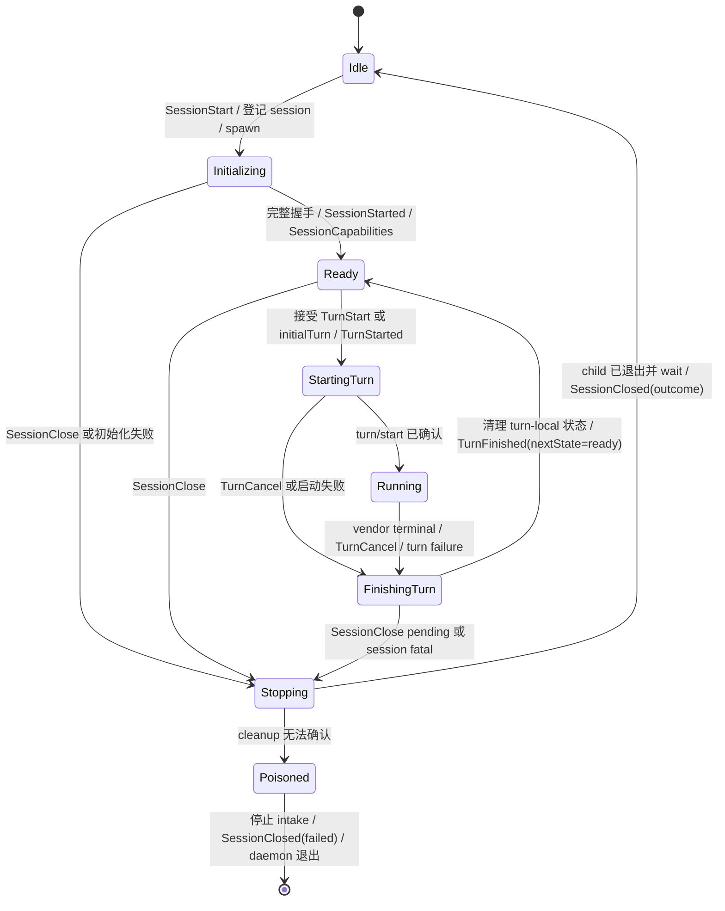

# agentdeckd 最小稳定边界设计

日期：2026-08-17
状态：实施中；Issue #3 生命周期与 #4 累计 streaming 切片已落地，M0 仍待 #5/#6
及真实门禁

## 决策摘要

在 GPUI desktop 连接 daemon 之前，先把 `agentdeckd` 的 Codex 路径收敛为一个
可独立验收的最小闭环（下文简称 M0）：

```text
一个本机 agentdeckd
  → 同一时刻至多一个 Codex session、一个 in-flight turn
  → session 独占一个 `codex app-server --listen stdio://` 子进程
  → 同一子进程、同一 thread 连续完成至少两个 turn
  → 每个 turn 都有真实累计 streaming 和唯一 terminal
  → SessionClose 后回收子进程并发出唯一 SessionClosed
```

app-server 子进程的生命周期与 **session** 对齐，不与单个 turn 对齐。
`TurnFinished` 只结束当前 turn：健康 session 回到 `Ready`，子进程、`sessionId` 和
`threadId` 保持不变。只有 `SessionClose` / 致命 session 失败才结束 session 并回收
子进程。

M0 只证明 daemon、Codex app-server 和中立 IPC 之间最短且可复用的纵向链路。
desktop 在此边界通过前不得连接 daemon；通过后，desktop 首切片可以只展示首轮，
但 daemon 放行门禁必须实际跑通同一 session 的两轮复用。

## 当前落地范围（Issue #3 / #4）

Issue #3 已把 M0 的 session/turn 生命周期骨架落到 Codex runtime；Issue #4 在该骨架上
把当前协议升级为 v4：

- `SessionStart(sessionId,resumeThreadId?,initialTurn?)`、`TurnStart`、`TurnCancel`、
  `SessionClose`，以及 `TurnStarted`、`TurnFinished`、`SessionClosed` 已进入 Rust 协议、
  schema 和 Swift mirror；旧 `SessionContinue` / `SessionCancel` 已移除，`TurnComplete`
  暂只留给 Claude Code。
- Codex session owner 独占一个 app-server child、stdin/stdout、RPC allocator、threadId 和
  turn 状态；完整执行 initialize response → initialized → thread/start|resume response，
  再发 SessionStarted → SessionCapabilities。
- owner 同时只接受一个 turn，支持同 connection 的顺序多轮；`TurnCancel` 使用
  `turn/interrupt`，`SessionClose` 才关闭 stdin、必要时终止进程组并 wait。owner 报告
  direct child wait、Unix 进程组有界轮询至 `ESRCH` 与 stderr pump join 完成后，RuntimeHub 先清路由和 handle，再发
  `SessionClosed`。lifecycle command 由单一有序 worker 执行；stdin EOF 会 drain 已读
  命令并关闭 retained session，cleanup 无法确认则 poison 并退出 daemon。
- locator、版本探测和 spawn 绑定同一绝对 binary，严格要求固定 0.145.0；生产 argv 固定
  为 `app-server --listen stdio://`。M0 options 固定为 never/read-only/medium、
  `persist=false`、无 MCP。
- protocol v4 为每个 `AgentItem` 增加必填 `turnId`、稳定 `itemId` 和
  `state=streaming|completed`；Rust schema、CLI 与 Swift mirror 同步消费该形态。
- Codex translator 按官方 item id 累积 assistant delta，每个非空 delta 发完整文本快照，
  completed 复用同一 ID 且至多一次；跨 turn、重复 completed 和 terminal 后 delta 不会
  污染下一轮。Codex 只声明 `StreamingMessages`，Claude Code 因仍丢弃 partial message
  delta 明确不声明该 capability。

这不是 M0 完成声明。#5 仍需持有同一 daemon 连接的 CLI/test driver 和真实 Codex
多轮/cancel/close E2E；#6 仍需把 RunRecord、lifecycle diagnostics 与可回读的
`diagnosticRef` 接入生产路径。本轮尚无真实 Codex session/prompt 回执；固定版本的官方
`ClientNotification.json` 已随实现补齐。

## 背景

`agentdeckd` 已有 RuntimeHub、Codex/Claude Code adapter、history、approval、vendor
control、run record 和 diagnostics 等较宽的代码表面。Issue #3 已闭合 Codex
session owner、握手、顺序 turn、interrupt、close/wait 和累计 assistant streaming 的
代码路径；desktop 最先依赖的完整 M0 仍有以下缺口：

- protocol v4 已有稳定 `turnId` / `itemId`、streaming state 和 typed `TurnFinished`，
  但真实 vendor 的
  completed/failed/interrupted 与 cancel 后恢复尚未由持久 E2E 验收。
- owner 的 fake/duplex 测试可复用一个 connection；当前 one-shot CLI 会在首轮
  `TurnFinished` 后自动 close，并等待 `SessionClosed` 与 daemon 回收，但仍无法驱动同一
  live session 的第二轮或 cancel 后续轮。
- run record 和 lifecycle diagnostics 基础设施存在，但尚未接到生产 session 事件流。

如果先接 desktop，UI 会被迫补偿这些未稳定语义。M0 的目标不是完成整个 daemon，
而是先把 desktop 最早依赖的 session/turn 契约做完整。

## 目标

- 创建或恢复一个 Codex thread，并让一个 app-server 子进程服务该 session 的多轮 turn。
- 同时最多一个 session、一个 in-flight turn；第二轮必须复用第一轮的 PID 和 threadId。
- 支持首个 `SessionStart` 携带初始 prompt，也支持 Ready 后显式 `TurnStart`。
- assistant message 使用稳定 `itemId` 和累计快照语义，客户端不解析 vendor delta。
- 每个 turn 都有 `TurnStarted` 和唯一 `TurnFinished`；成功、失败、取消均可判定。
- `TurnCancel` 只取消当前 turn，成功收口后 session 回到 Ready。
- `SessionClose` 明确关闭 session；`SessionClosed` 发出前完成正常清理。
- daemon stdin 在 handshake 或 turn 运行期间仍能及时处理 Ping、TurnCancel 和
  SessionClose。
- 接通现有 `RunRecord` 与 lifecycle diagnostics，不扩展两者的文件格式。
- 只使用 Codex 官方 app-server schema 和本机 Codex 登录状态；AgentDeck 不读取、
  保存或转发 vendor token。

## 非目标

以下能力不进入 M0 的实现或放行条件：

- Claude Code。
- history list/read/archive/rename，以及由 AgentDeck 搜索历史后恢复 session 的 UI。
- approval、用户输入、MCP elicitation 和 dynamic tool 的交互式处理。
- shell、diff、plan、reasoning、MCP、image、skill、custom prompt 的客户端展示契约。
- vendor control、vendor panel、运行中 steer 和并发 turn。
- run record 或 diagnostic log 的 schema/目录/脱敏格式扩展。
- 多 session、多客户端、远程 transport 和 Codex WebSocket transport。
- desktop UI、Markdown 渲染、会话列表和恢复界面。
- Codex app-server daemon/proxy 模式。

已有代码可以继续存在，但未列入 M0 的能力不能被 desktop 当作稳定接口，也不能在
M0 capabilities 中声明为已完成。

## 为什么直接连接 app-server

M0 固定由 `agentdeckd` 为每个 session 直接 spawn：

```text
codex app-server --listen stdio://
```

不用 `codex app-server daemon`，也不经 `codex app-server proxy`：

- AgentDeck 已有自己的 daemon；再依赖一个独立 Codex daemon 会增加第二套启动、
  发现、重连和版本漂移状态。
- stdio 子进程的所有权与一个 AgentDeck session 对齐，EOF、cancel、close 和进程
  回收都有单一责任方。
- stdout 只承载官方 JSONL，stderr 独立 drain，错误可归属到当前 session。
- 一个直接子进程已能保存同一 thread 的多轮状态；M0 不需要跨客户端共享 app-server。

只有以后出现经过测量的 app-server 冷启动瓶颈，或确实需要多个 AgentDeck 客户端
共享同一 Codex 服务时，才重新设计 daemon/proxy 模式。

## 版本与 binary 边界

M0 只支持 `protocol/CODEX_VERSION.txt` 固定的 Codex 版本：

- binary locator 先解析一个绝对路径；版本探测和 app-server spawn 必须使用同一路径，
  不能一个走 shell PATH、另一个走修复后的 GUI PATH。
- 缺失、版本无法解析或与固定版本不一致时，在 SessionStarted 前以
  `codex-version-unsupported` 关闭该 session，不尝试猜测兼容。
- 支持新版本前必须由该版本官方命令重生成 schema、审查 diff、更新 fixture 并运行
  真实 E2E；不能只因本机 binary 较新就扩 capabilities。
- M0 不自动重放失败 prompt。transport/protocol failure 前 vendor 可能已执行副作用，
  自动重放会重复操作；恢复必须创建新 session 并显式 thread/resume。

## 稳定 API 切片

M0 的协议仍由 `agentdeck-protocol` 派生 schema，只放行以下 session/turn 命令。
Ping、Selfcheck、ProtocolVersion 等无状态管理命令可以保留，但不改变本文状态机。

### 客户端命令

#### SessionStart

```text
SessionStart {
  sessionId,
  agentKind: codex,
  cwd,
  resumeThreadId?,
  initialTurn?: { turnId, prompt },
  vendorOptions
}
```

- `sessionId` 和 `initialTurn.turnId` 由 typed client 生成且非空。daemon 在 vendor I/O
  前登记 ID，因此初始化期间也能由 `SessionClose` 可靠收口，启动失败可以关联原请求。
- `resumeThreadId` 为空时调用 `thread/start`；非空时调用 `thread/resume`。M0 不负责
  发现可恢复 thread，调用方必须提供已知 ID。
- `initialTurn` 可省略；省略时 session 进入 Ready，之后由 `TurnStart` 开始第一轮。
- 若携带 `initialTurn`，仍必须先完成完整 session handshake、发出 SessionStarted 和
  SessionCapabilities，再接受该 turn 并执行与普通 TurnStart 相同的路径。handshake
  失败时 initialTurn 尚未被接受，因此只有 failed SessionClosed，没有伪造的 turn 事件。
- `cwd` 必须是绝对路径且指向现有目录；prompt 必须是非空纯文本。
- M0 固定 `approvalPolicy=never`、`sandbox=read-only`、
  `persistApproval=false`、`reasoningEffort=medium`、`mcpOverrides=[]`。其他值在 spawn
  前返回 `unsupported-session-options`，不能静默忽略。

固定选项只用于验证文本链路，避免 M0 等待交互式 approval；它不代表正式 coding
session 的产品默认值。

#### TurnStart

```text
TurnStart { sessionId, turnId, prompt }
```

- 只在对应 session 为 Ready 时接受。
- `turnId` 由 client 生成、在该 session 内唯一；daemon 记录所有已接受 ID，重复使用返回
  `turn-id-already-used`，不会再次写入 vendor。daemon 负责映射官方 Codex turn id。
- 已有 in-flight turn 时返回 `turn-already-running`；session 仍在 Initializing、Stopping
  或 Poisoned 时返回 `session-not-ready`。两种情况都不启动第二个 turn。
- `TurnStarted` 表示 daemon 已接受该命令，在向 app-server 发 `turn/start` 前立即发出；
  vendor 后续拒绝或写入失败通过同一 turnId 的 failed TurnFinished 收口。

#### TurnCancel

```text
TurnCancel { sessionId, turnId }
```

- 只针对匹配的当前 in-flight turn。
- StartingTurn/Running 中标记 cancel，再通过官方 `turn/interrupt` 取消；若 turn id 尚未
  从 vendor 获得，先记录 pending cancel，拿到 id 后立即 interrupt。
- 取消成功时先清理 turn-local 状态、确认 child 健康并回 Ready，再发
  `TurnFinished(outcome=canceled, nextState=ready)`。
- 重复 cancel 在 turn terminal 前是幂等 no-op；terminal 后返回 `turn-not-active`。

#### SessionClose

```text
SessionClose { sessionId }
```

- Ready 时关闭 app-server stdin 并有限等待；到期仍存活才终止其进程组，随后 `wait`
  direct child，并有界等待进程组消失，再发 SessionClosed。
- 初始化期间可以 close：终止并回收 child，不伪造 SessionStarted。
- 有 in-flight turn 时先按 TurnCancel 收口并发唯一 TurnFinished，再关闭 session；事件
  顺序必须是 `TurnFinished` → `SessionClosed`。
- close 只关闭 AgentDeck live session，不 archive、delete 或 rename Codex thread。

### 服务端事件

M0 稳定事件为：

1. `SessionStarted`
2. `SessionCapabilities`
3. `TurnStarted`
4. `AgentItem`
5. `TurnFinished`
6. `SessionClosed`
7. `Error`（命令错误或明确标注为非 terminal 的可见记录告警）

成功初始化时严格先发：

```text
SessionStarted → SessionCapabilities → TurnStarted? → AgentItem*
```

`SessionStarted` 只发送一次，且必须带非空 `sessionId`、`agentKind=codex` 和真实
`threadId`。`SessionCapabilities` 紧随其后，在它之前不得发 TurnStarted 或 AgentItem。

`TurnStarted`、`AgentItem`、`TurnFinished` 都必须带：

```text
sessionId + agentKind + threadId + turnId
```

同一 turn 的四个关联字段必须完全一致。初始 prompt 也必须发 TurnStarted，不能因它
来自 SessionStart 就省略 turn lifecycle。

protocol v4 已为 `ServerEvent::AgentItem` envelope 增加：

```text
itemId: String
state: streaming | completed
```

M0 只承诺 `AgentItem::AssistantMessage`：

- `itemId` 使用 app-server 官方 item id，同一消息从开始到完成保持不变。
- 每个非空 `item/agentMessage/delta` 先追加到 daemon buffer，再发送截至当前全部文本的
  `state=streaming` 快照；不把裸 delta 交给客户端累计。
- `item/completed` 发同一 itemId 的 `state=completed` 最终快照。completed payload 只有
  在保留已发累计前缀时才可作为最终文本；稀疏、变短或分叉的 payload 使用已累计文本，
  避免客户端可见内容回退。
- 同一 item 文本只能保持不变或追加，不能回退；completed 至多一次。
- completed-only 消息合法：直接发一份 completed 快照。

`TurnFinished` 是唯一 turn terminal：

```text
TurnFinished {
  sessionId,
  agentKind,
  threadId,
  turnId,
  outcome: succeeded | failed | canceled,
  nextState: ready | closing,
  summary?,
  error?
}
```

- `error` 在 failed 时必填，并携带有效 `diagnosticRef`。
- token 可以为空；`elapsedMs` 用 daemon 单调时钟计算，不依赖 vendor 是否提供耗时。
- 每个已接受的 turn 必须且只能收到一个 TurnFinished；之后不得再有该 turn 事件。
- `nextState=ready` 表示发出前已经清空 turn-local buffer、server-request route 和 cancel
  状态，且 session 已回 Ready；客户端此时才可立即发送下一条 TurnStart。
- `nextState=closing` 表示该 turn 已收口，但 session 已承诺进入 Stopping；客户端不得再发
  TurnStart，必须等待随后唯一的 SessionClosed。fatal failure 和 turn 运行期间收到
  SessionClose 都使用该值。
- TurnFinished 自身不回收 child；只有进入 session close/fatal cleanup 路径才回收。

`SessionClosed` 是唯一 session terminal：

```text
SessionClosed {
  sessionId,
  agentKind,
  threadId?,
  outcome: closed | failed,
  error?
}
```

- 正常 close 时，只有确认 child 已退出并被 wait、session 路由已清除后才发 closed。
- 初始化失败或 fatal session failure 也必须为已登记 session 发 failed close；若当时有
  in-flight turn，先发该 turn 的 failed/canceled TurnFinished。
- SessionClosed 后不得再有该 session 事件。

M0 capabilities 只声明经过验收的 StreamingMessages。CLI 版本、sandbox 列表等探测
信息可以继续报告，但不得把 approval、reasoning streaming、shell、diff、MCP 或
persistence 标成 desktop 可用。

## app-server 握手

每个 session 必须完整执行以下顺序，不能把 initialize response 当作握手已经完成：

```text
spawn `codex app-server --listen stdio://`
  → request: initialize
  → response: initialize result
  → notification: initialized
  → request: thread/start 或 thread/resume
  → response: thread result
  → SessionStarted
  → SessionCapabilities
  → Ready
```

- initialize、thread/start/resume 都按 request id 匹配响应；期间穿插的 notification
  进入同一个 pump，但不能越过事件顺序约束。
- `initialized` 必须在 initialize 成功响应之后、任何 thread request 之前写入。
- thread/start 从官方结果读取 thread id；thread/resume 必须核对结果对应请求的 ID。
- handshake 期间收到 SessionClose 时停止继续发送后续请求并进入 Stopping。
- handshake 保留明确有限超时；turn 不设置总时长或静默超时，客户端可随时 cancel。

## 生命周期与状态机

一个 `agentdeckd` 实例同一时刻最多持有一个 M0 session；该 session 同时最多一个
in-flight turn。只有一个 owner task 可以写 app-server stdin、推进状态和决定 terminal。



### 正常 turn 收口

1. 从官方 `turn/completed.params.turn.status` 读取
   `completed` / `interrupted` / `failed`，分别映射为 AgentDeck 的
   `succeeded` / `canceled` / `failed`。若 terminal notification 中出现 schema 允许但
   与 terminal 语义矛盾的 `inProgress`，按 `codex-terminal-status-invalid` 处理为 fatal
   protocol failure。
2. 决定唯一 outcome 和 nextState，停止该 turn 的事件转发。
3. 清空 item buffer、request route、vendor/client turn id 映射和 cancel pending。
4. 确认 app-server 连接健康，状态回 Ready。
5. 发唯一 `TurnFinished(nextState=ready)`。

因此客户端只有看到 `TurnFinished(nextState=ready)` 后，才可以立即对同一 session
发送下一条 TurnStart；第二轮必须复用相同 child PID 和 threadId。看到
`nextState=closing` 时只能等待 SessionClosed。

### 正常 session 收口

1. 停止接受该 session 的新 TurnStart。
2. 若有 in-flight turn，先 interrupt 并发唯一 TurnFinished。
3. 关闭 app-server stdin；有残留进程时终止其独立进程组。
4. `wait` 回收直接 child；Unix 上轮询 `kill(-pgid, 0)` 至 `ESRCH`，再停止 stdout/stderr pump。
5. 清空 session 路由并回 Idle。
6. 发唯一 SessionClosed：用户正常 close 为 closed；初始化或 session fatal 为 failed。

### Poisoned / Stopping

cleanup failure 不能伪装成可恢复状态：

- 一旦无法确认 direct child 已回收、进程组已消失、pump 已停止或所有权已释放，立即进入 Poisoned。
- 先停止 daemon intake，拒绝所有新 SessionStart/TurnStart；绝不回 Ready 或 Idle。
- 若仍有 in-flight turn，先给它一个 failed TurnFinished。
- 发 `SessionClosed(outcome=failed, error=codex-cleanup-failed)`，error 必须带
  diagnosticRef。
- 随后 daemon 退出；不能继续服务另一个 session。

完成、取消和 close 的竞态由单一 owner 串行决定：先进入 FinishingTurn/Stopping 的
命令确定结果，后到信号不得改写 terminal，也不得造成第二个 terminal。

## 不支持的 app-server request

M0 固定为无交互文本链路，因此任何带 JSON-RPC id 的 server request 都不能
静默忽略。至少覆盖：

- command/file/permission approval。
- user input request。
- MCP elicitation。
- dynamic tool call。
- 当前固定 schema 中其他未实现 server request。

处理规则：

1. 若官方 schema 定义 typed decline/cancel response，立即用该形状显式拒绝。
2. 没有 typed 拒绝形状时，返回一个与原 request id 匹配的 JSON-RPC not-supported
   error；不得只记录日志。
3. 将当前 turn interrupt，并以 `codex-unsupported-server-request` 收口为 failed；不能等待
   vendor 自己超时。
4. 若 response 或 interrupt 写入失败、request id 无法可靠关联，session 进入
   Stopping/Poisoned，不能回 Ready。
5. 若 request 发生在没有 in-flight turn 的 Ready 状态，显式拒绝后直接以 failed
   SessionClosed 收口，不伪造 TurnFinished。
6. IPC 和 diagnostics 只记录 method、request id 和 failure code，不转发原始 payload。

这样 approval 等能力虽不属于 M0，也不会让最小链路挂死或制造假完成。

## 不变量

M0 通过以下不变量定义“完整”，而不是以文件或 trait 已存在作为完成依据：

1. **单 session**：非 Idle 时第二个 SessionStart 返回 session-busy，不 spawn 第二个
   child，也不替换当前 session。
2. **单 child**：Initializing/Ready/Running/Stopping 期间恰好由该 session 独占至多一个
   app-server child；child 必须位于独立进程组。
3. **单 turn**：一个 session 同时最多一个 in-flight turn。
4. **session 复用**：健康 turn 在发 `TurnFinished(nextState=ready)` 前已经回 Ready，且不
   kill child；至少两轮保持同 PID、同 sessionId、同 threadId。
5. **握手完整**：顺序固定为 initialize response → initialized notification →
   thread/start 或 thread/resume response → SessionStarted → SessionCapabilities → Ready。
6. **事件有序**：SessionStarted → SessionCapabilities → TurnStarted → AgentItem* →
   TurnFinished；SessionClosed 只在 session 最终收口出现。
7. **关联完整**：TurnStarted/AgentItem/TurnFinished 都携带一致的 sessionId、agentKind、
   threadId、turnId。
8. **真实 streaming**：真实多-delta fixture 在 item/completed 前产生可见的累计 assistant
   快照；不能把 final-only 冒充 streaming。
9. **两个 terminal 层级**：每个 accepted turn 恰好一个 TurnFinished；每个 accepted
   session 恰好一个 SessionClosed。二者不能互相替代；客户端只按 TurnFinished 的
   typed `nextState` 判断能否继续该 session。
10. **cancel 不关 session**：TurnCancel 完成后健康 child 回 Ready；只有 SessionClose 或
    fatal session failure 回收 child。
11. **terminal 后零事件**：TurnFinished 后该 turn 零事件；SessionClosed 后该 session
    零事件。
12. **主循环不阻塞**：handshake、turn、interrupt 和 cleanup 不阻塞 Ping、TurnCancel、
    SessionClose 的 intake。
13. **request 必答**：每个 server request 要么得到匹配 response，要么导致明确的
    interrupt/failure；不存在“忽略并继续等”的分支。
14. **Poisoned 不复活**：cleanup 无法确认时先停止 intake，绝不回 Ready/Idle，发失败
    close 后 daemon 退出。
15. **协议不猜测**：方法名、字段位置和状态值以 `protocol/` 固定版本的官方 schema
    为准。
16. **token 边界不变**：只继承 Codex 登录环境，不读取 token；vendor stderr 和原始
    frame 不进入 IPC、record 或 diagnostic log。

## 失败语义

| 失败点 | turn terminal | session terminal / 后续状态 |
| --- | --- | --- |
| JSON 无法解析、参数无效、命令不在 M0 | 无；返回 Error | session 不受影响或不得 spawn |
| daemon 非 Idle 收到新 SessionStart | 无；返回 session-busy | 当前 session 不受影响 |
| 已有 in-flight turn 时收到 TurnStart | 无；返回 turn-already-running | 当前 turn/session 不受影响 |
| 复用该 session 已接受的 turnId | 无；返回 turn-id-already-used | 当前 session 保持 Ready |
| Initializing/Stopping/Poisoned 时收到 TurnStart | 无；返回 session-not-ready | 当前状态不变 |
| 找不到 codex 或 spawn 失败 | 无；initial turn 尚未接受 | SessionClosed(failed)，清路由 |
| initialize / initialized / thread request 失败 | 无；initial turn 尚未接受 | SessionClosed(failed)，回收 child |
| turn/start 写入或响应失败 | TurnFinished(failed) | child 健康则 Ready，否则关闭 session |
| vendor JSON/字段违反固定 schema | TurnFinished(failed) | 无法恢复关联时 SessionClosed(failed) |
| 未支持的 server request | 显式拒绝后 TurnFinished(failed) | interrupt 成功则 Ready，否则关闭 session |
| app-server 在 SessionClose 前 EOF / 退出 | in-flight turn 为 failed | SessionClosed(failed)；child 已 wait |
| `turn/completed` 报 completed / failed / interrupted | succeeded / failed / canceled | 健康 child 回 Ready，nextState=ready |
| `turn/completed` 报 inProgress | TurnFinished(failed) | fatal protocol failure；nextState=closing，随后 SessionClosed(failed) |
| TurnCancel | TurnFinished(canceled, nextState=ready) | interrupt 成功后先清理并回 Ready，再发 terminal |
| SessionClose during turn | 先 TurnFinished(canceled, nextState=closing) | 清理成功后 SessionClosed(closed) |
| child/pump cleanup 无法确认 | in-flight turn 为 failed、nextState=closing | Poisoned；SessionClosed(failed) 后 daemon 退出 |
| stdout 写失败或 daemon stdin EOF | 客户端可能收不到 terminal | 停止 intake，仍必须尝试回收 child 后退出 |

## Run record 与 diagnostics

M0 必须接通已有基础设施，不新增 record/diagnostic schema：

- 一个 session 对应一个现有 `RunRecord`，`runId=sessionId`。SessionStart 参数通过验证
  后、spawn 前调用 `RunRecord::open`；SessionClosed 先作为 ServerEvent append，再调用
  现有 `close` 写 footer。
- SessionStarted、SessionCapabilities、TurnStarted、AgentItem、TurnFinished、
  SessionClosed 按实际 IPC 顺序 append。新增 turnId 等属于 ServerEvent 协议演进，
  不改变 runHeader/runFooter 或 JSONL 容器格式。
- 每次 append 都经过现有 redact；record 仍只写 AgentDeck data dir，不写用户项目。
- record open/append/close 失败不阻断健康 Codex turn，但不能静默：写一条 lifecycle
  diagnostic，并发 session-scoped 非 terminal Error `record_write_failed`。
- lifecycle diagnostics 至少覆盖 session 状态迁移、Codex CLI 版本、child PID、
  initialize/initialized/thread/turn request、interrupt、child exit/wait、turn outcome、
  session outcome 和 cleanup 结果。
- 复用现有 DiagnosticEvent 字段；PID 等放已有 detail，不扩日志 schema。
- session/turn failure 的 ProtocolError 必须设置 diagnosticRef。引用可由现有 runId +
  eventSeq 组成，能在 diagnostic report 中定位同一条事件；desktop 不解析自由文本。
- diagnostic 写失败沿用现有 stderr fallback，不把观测系统失败升级成 vendor session
  failure。

## 测试与验收

### 先修测试门控

Issue #7 已把该前置门禁落到代码和 CI：所有会 spawn `codex` / `claude`、读取真实
vendor history 或依赖登录态的测试，统一要求 **`AGENTDECK_E2E=1`** 严格等值
才进入；未设置、空值、`0`、`false` 或其他值都在真实 vendor I/O 前 skip。version/auth
probe 单测使用可注入 fake binary，不执行用户 PATH 中的 vendor。

默认入口是：

```bash
scripts/verify-offline-tests.sh
scripts/verify-agent-docs.sh
```

offline 脚本使用临时 HOME 隔离用户 vendor history 与默认 AgentDeck data dir，并在 PATH
首位放置 marker shim；在变量 unset 与 `0` 时
执行完整 workspace tests；空值、`false` 和其他值执行全部 gated integration targets，
每次都断言 shim 未被执行。该先修项完成只移除测试基础设施阻断，不提升本文 session、
streaming、terminal 或 cleanup 的 M0 状态；普通 Cargo passed 也不等于真实 vendor E2E
证据。

### 确定性测试

Issue #3/#4 的 focused 离线入口是：

```bash
cargo test -p agentdeck-protocol
cargo test -p agentdeck-cli --bin agentdeck
cargo test -p agentdeckd --lib codex::
cargo test -p agentdeckd --test codex_translate
cargo test -p agentdeckd --lib runtime::hub
cargo test -p agentdeckd --lib runtime::router
cargo test -p agentdeckd --test codex_adapter_shape
cargo test -p agentdeckd --test cc_fixture_replay
swift test
```

这些切片已有 protocol v4 round-trip/schema、累计 assistant snapshot、同 binary
probe/spawn 与 argv/initialized 顺序、session owner 和 RuntimeHub/router 的
fake/duplex/stub 证据。Issue #3 当前还覆盖同
connection 两轮、interrupt 后复用、running close、malformed/unmatched/EOF、handshake
failure、unsupported request、terminal status、resume 固定参数、stderr pump join，以及
stdin EOF/cleanup failure 的 poison→daemon exit；Issue #4 覆盖多 delta 累计、ID/turn
隔离、文本不回退、completed-only/duplicate completed、terminal 后 delta 丢弃及
`AgentItem` 先于 `TurnFinished`。下面列表仍是完整 M0 验收要求；#5 真实持久链路与 #6
record/diagnostics 不能因离线测试通过而视为完成。

- production spawn 参数显式包含 `app-server --listen stdio://`；版本探测和 spawn 使用
  同一绝对 binary。版本缺失或不匹配在 SessionStarted 前稳定失败。
- 协议 round-trip 与 schema 漂移覆盖 TurnStart、TurnCancel、SessionClose、
  SessionClosed，以及所有 turn event 的 turnId。
- app-server fake/fixture 严格断言 initialize response 后才写 initialized，之后才写
  thread/start/resume；任一步乱序都失败。
- 官方多-delta fixture 验证累计文本单调、itemId 稳定、completed 不重复且在
  TurnFinished 前。
- 官方 turn/completed fixture 覆盖 completed、failed、interrupted、inProgress，并从
  `params.turn.status` 读取；前三者映射为 succeeded、failed、canceled，inProgress
  触发 fatal protocol failure。
- fake app-server 覆盖正常两轮、turn cancel 后再开一轮、session close、handshake
  失败、畸形 JSON、提前 EOF、完成/cancel/close 竞态和 cleanup failure。
- approval、user input、MCP elicitation、dynamic tool fixture 逐一断言收到匹配 request id
  的拒绝 response 和明确 TurnFinished，不允许 pump 挂起。
- 两轮确定性集成测试断言 child PID、sessionId、threadId 相同而 turnId 不同；第二轮前
  没有 spawn。
- run record 测试断言一个文件包含两轮有序事件和一个 footer；record 写失败有可见
  Error 与 diagnosticRef，session 仍可继续。
- lifecycle diagnostic 测试断言成功、cancel、close、Poisoned 都能按 session/turn id
  关联；Poisoned 后没有新 intake。
- RuntimeHub 在 turn 运行时仍能处理 Ping、TurnCancel 和 SessionClose。

### 真实 Codex 门禁

在与 `protocol/CODEX_VERSION.txt` 一致且已 `codex login` 的环境中运行：

```bash
cargo build --locked -p agentdeckd --bin agentdeckd
AGENTDECK_DAEMON_BIN="$PWD/target/debug/agentdeckd" AGENTDECK_E2E=1 \
  cargo test -p agentdeck-cli --test e2e_codex -- --nocapture
```

同一个 E2E session 必须完成：

1. SessionStart 携 initialTurn，收到 SessionStarted、SessionCapabilities、TurnStarted、
   至少一份 completed 前的 streaming snapshot 和 TurnFinished(succeeded)。
2. 不关闭 session，发送第二个 TurnStart，再次完成 streaming → TurnFinished。
3. 两轮 sessionId/threadId 相同、turnId 不同；通过测试 hook 或现有 diagnostic detail
   读回确认 app-server PID 相同，期间没有第二次 spawn。
4. 第三轮在首个 streaming snapshot 后 TurnCancel，收到唯一 canceled TurnFinished，
   child 仍存活并回 Ready。
5. 同一 session 再开第四轮并成功，PID 和 threadId 仍不变。
6. 发送 SessionClose，收到唯一 SessionClosed(closed)，并确认 child 已 wait、Unix
   进程组已消失；同一个 run record 覆盖全部轮次和 close。

模型输出内容不作精确字符串断言。多-delta 的确定性由 fixture 负责；真实 E2E 只
断言至少一份发生在 completed/terminal 前的 streaming snapshot。

### 最终代码验收

完整门禁为：

```bash
scripts/verify-offline-tests.sh
cargo build --locked \
  -p agentdeckd --bin agentdeckd \
  -p agentdeck-cli --bin agentdeck
AGENTDECK_DAEMON_BIN="$PWD/target/debug/agentdeckd" \
  ./target/debug/agentdeck --data-dir /tmp/agentdeck-m0 selfcheck
AGENTDECK_DAEMON_BIN="$PWD/target/debug/agentdeckd" \
  ./target/debug/agentdeck --data-dir /tmp/agentdeck-m0 diagnostics report
AGENTDECK_DAEMON_BIN="$PWD/target/debug/agentdeckd" AGENTDECK_E2E=1 \
  cargo test -p agentdeck-cli --test e2e_codex -- --nocapture
scripts/verify-agent-docs.sh
```

普通 cargo test 中 E2E 的 skip 不算真实 vendor 证据；必须单独记录
`AGENTDECK_E2E=1`、Codex 版本和 E2E 结果。

## desktop 解锁条件

只有同时满足以下条件，才能开始 `agentdeck-desktop → typed local client → agentdeckd`
的真实连接工作：

- 本文 handshake、API、两级 terminal、状态机和不变量已在代码及 schema 中落地。
- 所有真实 vendor 测试已统一 E2E 门控，标准 `cargo test` 已证明 offline-safe。
- focused 测试、完整 Cargo 测试、CLI selfcheck 与真实 Codex E2E 在同一提交通过。
- 真实 E2E 证明同一 child PID、同一 threadId 连续完成两轮，并在 TurnCancel 后还能
  完成下一轮。
- SessionClose 有 direct child wait 和 Unix 进程组消失证据；cleanup failure 测试证明
  信号、探测或等待失败只会 Poisoned → failed SessionClosed → daemon exit，不会回 Ready/Idle。
- run record 和 lifecycle diagnostics 已接线，失败 ProtocolError 有可定位的
  diagnosticRef。
- capabilities 只声明已验收能力，`agentdeckd` 功能完整度文档把 M0 标为已验收并链接
  实际证据。

desktop 首切片可以只渲染 initial turn 的输入、累计 assistant message、cancel 和
TurnFinished；它暂时不必暴露第二轮输入或 SessionClose UI。但 daemon gate 必须先用
两轮复用证明 session 边界稳定，不能用 desktop 只展示首轮作为降低 daemon 验收标准的
理由。
