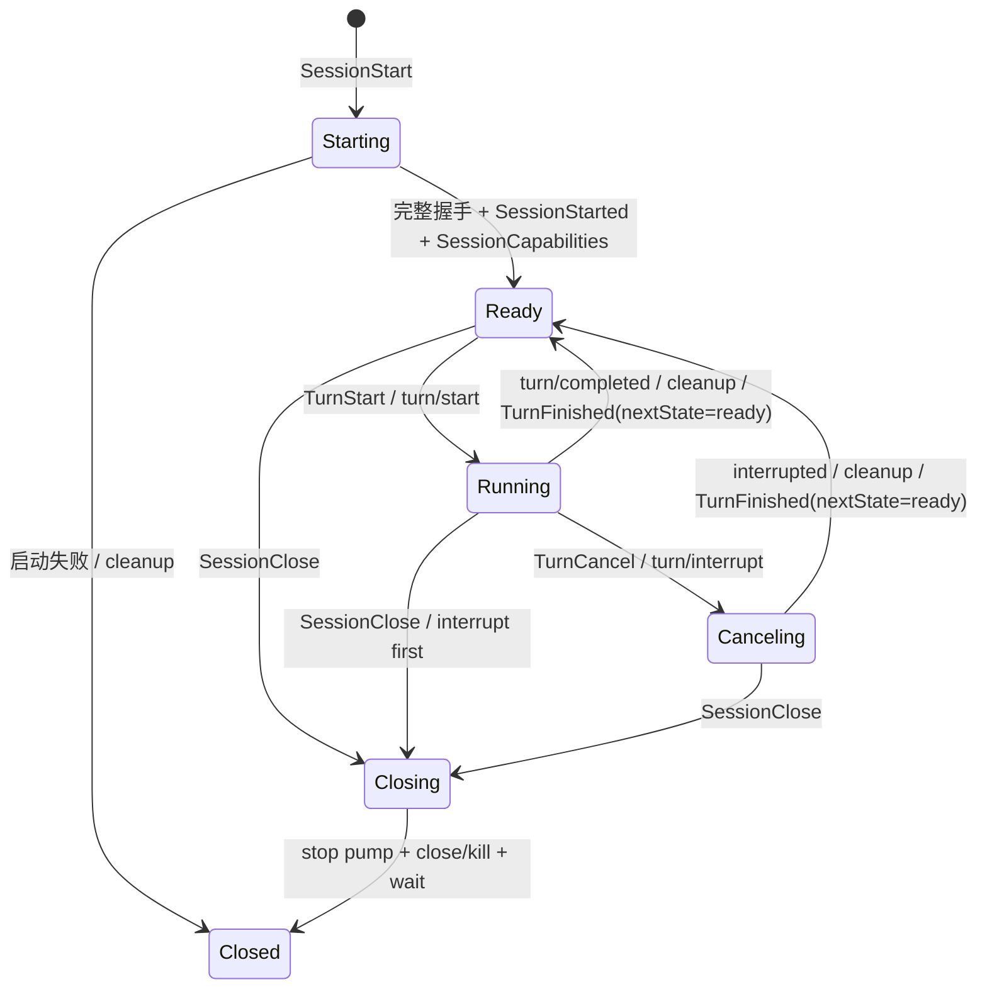

# ADR：Codex app-server 连接方式与生命周期

- 日期：2026-08-17
- 状态：已接受；Issue #3 生命周期与 #4 累计 streaming 已落地，M0 仍待 #5/#6 与
  真实门禁

## 决策摘要

`agentdeckd` 直接启动并持有：

```text
codex app-server --listen stdio://
```

当前不连接用户全局的 `codex app-server daemon`，也不经
`codex app-server proxy` 转发。

一个 Codex app-server 子进程只属于一个 AgentDeck runtime session，其 stdin、
stdout、stderr、请求关联表、stdout pump 和进程组均由该 session 的单一 owner 管理。
子进程不能脱离 session 变成用户全局服务，也不能被 desktop 或 CLI 绕过
`agentdeckd` 直接访问。

本决策只确定 transport 和所有权，不扩大当前功能范围。
[agentdeckd 最小稳定边界设计](2026-08-17-agentdeckd-minimum-stable-boundary-design.md)
定义的 M0 是一个 session-scoped child、多个顺序 turn：`SessionStart` 建立 session，
`TurnStart` 发起一轮，健康终态在回到 `Ready` 后发
`TurnFinished(nextState=ready)`，`TurnCancel` 只取消当前 turn，
`SessionClose` 才结束正常 session 并回收 child。不得为每个 turn 重新启动 app-server。

## 背景

AgentDeck 已经有自己的本地 daemon `agentdeckd`。它负责把 Codex 和 Claude Code 的
原始协议翻译为 AgentDeck typed IPC，并向 desktop、CLI 和后续客户端提供统一边界。

Codex CLI 0.145.0 同时提供三种相关入口：

- `codex app-server --listen stdio://`：当前默认 transport，使用逐行 JSONL。
- `codex app-server daemon`：管理一个持久的本地 app-server daemon。
- `codex app-server proxy`：把当前进程的 stdio 字节转发到已运行 daemon 的 control
  socket。

后两项没有提供另一套更丰富的 agent 协议；proxy 后面仍然是同一个 app-server
JSON-RPC。这里真正需要决定的是：由 `agentdeckd` 持有 Codex 子进程，还是依赖一套
独立、用户全局、可被其他 Codex 客户端管理的 daemon 生命周期。

当前目标是先稳定本机单 session 的顺序多轮
`TurnStart → streaming → internal Ready → TurnFinished(nextState=ready)`；远程、
跨客户端共享 runtime 和接管均不在当前桌面切片中。

## 官方依据

本决策基于以下 OpenAI 官方资料和 Codex CLI 0.145.0 本机 help：

1. [Codex App Server](https://learn.chatgpt.com/docs/app-server) 将 app-server 定义为
   rich client 的深度集成接口，覆盖认证、历史、审批和流式 agent 事件。官方入门示例
   由客户端直接 spawn `codex app-server`，通过 stdin/stdout 通信。
2. 同一文档规定每个 transport connection 只执行一次 `initialize`，收到 response 后
   再发送 `initialized` notification，随后才能 start/resume thread、start/steer/
   interrupt turn 并持续消费通知。
3. 同一文档说明 stdio transport 是 JSONL；schema 生成物与执行生成命令的 Codex
   版本精确对应。
4. [Developer commands：`codex app-server`](https://learn.chatgpt.com/docs/developer-commands#codex-app-server)
   将 `--listen stdio://` 作为本地 app-server transport，并提示该命令面可能变化。
5. [Developer commands：`codex remote-control`](https://learn.chatgpt.com/docs/developer-commands#codex-remote-control)
   明确说明 managed remote-control/SSH 工作流不是构建本地协议客户端时
   `codex app-server --listen` 的替代品。
6. `codex app-server daemon bootstrap --help` 在 0.145.0 中将 durable daemon 管理描述为
   SSH-driven use；`codex app-server daemon version` 用于比较本地 CLI 与已运行 daemon
   版本；`codex app-server proxy --help` 只承诺把 stdio bytes 转发到 control socket。

app-server 的版本变化风险不会因改用 daemon/proxy 消失：两条路径消费的是同一套
app-server wire protocol。AgentDeck 应通过固定版本、官方 schema 和真实 E2E 管理这项
风险，而不是增加第二套 daemon 状态。

## 决策驱动因素

- **所有权唯一**：负责发送请求的一方也负责发现 EOF、取消、终止和回收进程。
- **失败可归因**：child、pipe 和 protocol failure 必须能关联到唯一 AgentDeck
  session。
- **版本确定**：探测、spawn 和 schema 校验必须指向同一个 Codex binary。
- **测试可重复**：fixture/fake app-server 和真实门控 E2E 不依赖用户预先启动全局
  daemon。
- **范围最小**：M0 不需要跨客户端共享、SSH remote control 或常驻 Codex runtime。
- **token 边界不变**：AgentDeck 只继承 Codex 原生登录环境，不读取、保存或转发
  vendor token。

## 选定方案

### 进程所有权

`CodexAdapter` 通过统一的 binary locator 找到一个 Codex executable，并用该**同一绝对
路径**完成版本探测和 app-server spawn。生产命令显式携带
`app-server --listen stdio://`，不依赖默认 transport。

child 必须：

- 使用 piped stdin/stdout/stderr。
- 在 Unix 上拥有独立进程组，以便清理 MCP helper 和 sandbox helper 子树。
- 持续 drain stderr，避免回压；原始 stderr 不进入 AgentDeck IPC。
- 由 session owner 持有 `Child`、stdin writer、stdout reader/pump 和 RPC id allocator。
- 在 session 结束和 `agentdeckd` 退出时完成 wait；kill-on-drop 只作最后兜底，不能替代
  正常清理路径。

### session 生命周期

M0 直接采用 session-scoped child。一个正常 session 的 vendor 生命周期为：

```text
resolve exact Codex binary + validate version
  → spawn app-server child
  → initialize request / response
  → initialized notification
  → thread/start 或 thread/resume request / response
  → 取得真实 threadId
  → SessionStarted → SessionCapabilities
  → Ready
  → TurnStart → turn/start request / response
  → 持续路由 item / delta / server request
  → turn/completed → Ready → TurnFinished(nextState=ready)
  → 可重复 TurnStart → Ready → TurnFinished(nextState=ready)
  → SessionClose
  → 停泵、关闭 child、wait、清空 session 路由
```

`SessionStarted` 只能在 `initialize`、`initialized` 和 `thread/start|resume` 成功且已取得
真实 `threadId` 后发送，随后发送 `SessionCapabilities` 并进入 `Ready`。握手或 thread
启动失败不得产生 phantom session。

M0 状态机固定为：



不变量：

- 每个 session 同时至多一个 in-flight turn；已有 in-flight turn 时收到第二个
  `TurnStart` 返回 `turn-already-running`，不能排队或覆盖。Initializing、Stopping 或
  Poisoned 时收到 TurnStart 返回 `session-not-ready`。
- caller-owned `turnId` 在 session 内一次性使用；完成后复用同一 ID 返回
  `turn-id-already-used`，不产生第二组 wire frame 或 lifecycle event。
- 每个 accepted `TurnStart` 必须且只能收到一个 `TurnFinished`。它是 turn terminal，
  不是 session terminal。
- 对正常完成、vendor turn failed 和已确认 interrupt 的可恢复 turn，`TurnFinished` 发出
  前清理本 turn 的 item buffer、turn id、approval/server-request 路由；发出时携带
  `nextState=ready`，session 已经可以立即接受下一轮。不可恢复的 transport/protocol
  failure 使用 `nextState=closing`，客户端只能等待 SessionClosed，不能套用 ready 语义。
- 正常成功、vendor turn failed 和用户 cancel 都保留同一个 child、RPC connection 与
  `threadId`。
- `TurnCancel` 使用官方 `turn/interrupt`；收到 interrupted terminal 后先清理 turn-local
  状态、确认 child 健康并回到 `Ready`，再发
  `TurnFinished(canceled, nextState=ready)`，不能把 cancel 实现成 session close。
- 正常情况下只有 `SessionClose` 回收 child。不可恢复的 transport/protocol failure 和
  daemon 退出属于异常清理，不得假装仍为 `Ready`。
- `SessionClose` 在 turn 运行时先 interrupt，再停止 pump、关闭或终止进程组并 wait；
  Unix 上还要有界轮询 `kill(-pgid, 0)` 至 `ESRCH`，cleanup 完成后才确认 close。

### 请求与事件关联

所有有 response 的 app-server request 都必须进入统一 RPC allocator 和 correlation table，
包括 `initialize`、`thread/start|resume`、`turn/start` 和 `turn/interrupt`。

不能只写入 `turn/start` 后等待通知：同步 response 可能立即返回参数、版本、认证或
thread 状态错误。此类错误必须收敛为当前 session 的唯一失败终态。

stdout 只允许一个 reader。它负责区分：

- 与 client request id 对应的 response。
- 不带 id 的 notification。
- 需要 client response 的 server request，例如 approval。

上层 translator 不能各自读取同一 stdout，也不能以“忽略不认识的 response”代替
correlation。

M0 必须显式处理 server request，不能只识别 notification：

- 只有 M0 allowlist 内、已有官方 response schema 且已完成端到端验证的 server request
  才能等待客户端回写。
- 收到不在 allowlist 的 server request 时，立即记录
  `codex-unsupported-server-request`；先按官方 schema 回匹配 request id 的 typed
  decline/cancel，若无对应形状则回 JSON-RPC not-supported error，再对当前 turn 发送
  `turn/interrupt`。不得静默丢弃 request 后让 app-server 永久等待 response。
- 该 turn 以 `TurnFinished(failed)` 收口，而不是伪装成用户取消；错误必须携带可关联的
  `diagnosticRef`。
- 只有 app-server 已确认 pending request/turn 被解除，session 才能回到 `Ready`。如果
  interrupt 超时、request 仍未 resolved 或连接状态不再可信，则把它升级为不可恢复的
  protocol failure，关闭并回收该 session child。
- fake app-server 必须覆盖 unsupported server request，不允许靠真实模型偶然不触发来
  证明不会悬挂。

## 版本策略

M0 只支持 [protocol/CODEX_VERSION.txt](../../protocol/CODEX_VERSION.txt) 固定的
`codex-cli 0.145.0`。

具体规则：

1. binary locator 返回绝对路径；`--version` 与 `app-server` 必须执行这一路径，避免
   macOS GUI stripped PATH 下探测一个 binary、实际启动另一个 binary。
2. 在产生 `SessionStarted` 前比较完整版本。缺失、无法解析或不匹配均返回稳定的
   `codex-version-unsupported`，不得以 `codex unknown` 继续运行。
3. `protocol/` 中使用该版本的
   `codex app-server generate-json-schema --out <dir>` 生成官方快照。除 Request、Server
   Notification 和 Server Request 外，必须保留握手需要的 `ClientNotification`；
   0.145.0 的该 schema 明确定义了 `initialized`。
4. 不以宽泛 semver 范围推断兼容。支持新版本前必须生成并审查 schema diff、更新翻译
   fixture，并在同一提交运行真实 Codex E2E。
5. 只有完成上述证据后，才把新版本加入显式 allowlist 或移动固定版本；capabilities
   不能仅因本机 binary 较新就自动宣称新功能。

直接 child 让上述策略只涉及一个已解析 binary。若采用 managed daemon，则还要处理
“本地 CLI 已升级但旧 daemon 仍在运行”的第二个版本状态，并决定是否有权重启可能被
其他客户端使用的全局服务；M0 不承担这项协调。

## 失败与恢复

### 启动阶段

- binary 不存在、版本不符、spawn 失败、pipe 缺失、initialize 或 thread request
  失败时，不发送 `SessionStarted`。
- 已登记的 M0 session 必须先终止并 wait child，再收到唯一、带 `diagnosticRef` 的
  `SessionClosed(failed)`。它从未进入 `Ready`，不能接受 `TurnStart`。
- 有限 handshake timeout 到期后按同一路径清理，不留下后台 child。

### turn 运行阶段

- `turn/completed.params.turn.status` 的官方值 `completed`、`failed`、`interrupted`
  分别映射为 AgentDeck outcome `succeeded`、`failed`、`canceled`。三者都先把当前 turn
  状态收敛、清理 turn-scoped 路由并回到 `Ready`，再发唯一
  `TurnFinished(nextState=ready)`；vendor turn failed 不能被误当成 session failure。
- 若 terminal notification 中出现 schema 允许但与 terminal 语义矛盾的 `inProgress`，
  以 `codex-terminal-status-invalid` 收口当前 turn，发
  `TurnFinished(failed, nextState=closing)`，随后关闭 session，不能猜成成功。
- malformed frame、未关联 response、app-server EOF 或非零退出在 vendor terminal 前
  发生时，当前 turn 失败且连接不再可信。先停止事件转发并停止接受新命令，回收
  dead/invalid child 后依次发送唯一 `TurnFinished(failed, nextState=closing)` 与
  `SessionClosed(failed)`；该错误必须明确 session 已不可继续，不能回到 `Ready`。
- **不得自动重放 prompt。** app-server 退出前可能已经执行了命令或修改文件，透明
  重放会重复副作用。
- 保留已取得的 `threadId` 作为诊断和后续显式恢复依据；M0 不自动恢复。显式 continue
  必须建立新 session-scoped child、重新
  `initialize → initialized → thread/resume`，但不能自动提交原 prompt。

### 取消

- Running 状态先调用官方 `turn/interrupt`，等待 interrupted terminal 和 bounded
  interrupt grace period。
- 正常收到 interrupted 后，先清理 turn-scoped 状态、确认 child 健康并回到 `Ready`，
  再发唯一 `TurnFinished(canceled, nextState=ready)`；child、connection 和 `threadId`
  必须保持不变，客户端收到该 terminal 后可立即开始下一轮。
- interrupt 超时说明连接状态不再可信，升级为不可恢复的 session failure，终止并 wait
  child。不能一边保留挂住的 request，一边声称 session 已 ready。
- `TurnCancel` 只作用于当前 turn。关闭 session 必须使用独立的 `SessionClose`。

### cleanup 失败

`TurnFinished` 不触发 child cleanup，只清理本 turn 状态。`SessionClose`、不可恢复的
transport/protocol failure 或 daemon 退出时，如果不能确认 direct child 已退出、Unix
进程组已消失或 pump 已停止，daemon 不能确认 session 已关闭。M0 进入 Poisoned：先停止 intake，给仍在运行的 turn 发唯一
failed terminal，再发 `SessionClosed(failed, codex-cleanup-failed)` 并退出
`agentdeckd`；绝不回到 Ready/Idle，避免新 child 与失去所有权的旧 child 并存。

## Run record 与 diagnostics

M0 必须把现有可观测基础设施接入生产 session，但不扩展已有文件格式或 IPC 字段：

- `SessionStart` 在任何 vendor I/O 前分配一个 session `runId`；确认 exact Codex binary
  version 后，使用现有 `RunRecord::open` 写一次 v2 `runHeader`，再 spawn app-server。
  version probe 自身失败时仍用预分配 `runId` 写 diagnostic event。一个多轮 session 共用
  同一个 run record；每个已发出的中立 `ServerEvent` 继续通过现有 `append_event` 写入，
  `SessionClose` 时写现有 `runFooter`。
- session、turn、spawn、initialize、interrupt、unsupported server request、child exit
  和 cleanup 事件使用现有 `DiagnosticEvent` 字段写入 `diagnostic.log`，沿用
  `runId` / `threadId` / `requestId` / `eventSeq` 关联，不增加新的 schema 字段。
- M0 内所有启动失败、turn failure、unsupported server request、transport failure 和
  cleanup failure 的 `ProtocolError.diagnosticRef` 必须非空。它使用当前 session 的
  `runId` 作为 opaque reference，使 run record 与 diagnostic log 能按已有字段关联；
  desktop 不解析其内部格式。
- run record 写失败不能中断有效 Codex turn，但必须产生可见的
  `record_write_failed`，同时写 diagnostic event 并携带同一 `diagnosticRef`；不能静默
  忽略。diagnostic log 自身仍是 best effort，不反向改变 turn outcome。
- prompt、assistant 文本和 vendor 原始 frame 是否进入 record 完全沿用现有
  `RunRecord` / redaction 行为；本 ADR 不增加新 payload、索引、数据库或日志格式。

M0 验收必须证明一次多轮 session 的 header、各轮事件、失败关联和 footer 落在同一个
`runId` 下，并且 `diagnosticRef` 可以在对应 diagnostic 行的 `runId` 中找到。

## 实施进展与剩余差距

Issue #3 已把本 ADR 的 transport 与生命周期主路径落到代码：

1. `CodexBinary` 解析一个规范绝对路径，使用同一路径做 `--version` probe 和 spawn，
   严格要求 `protocol/CODEX_VERSION.txt` 固定的 0.145.0；生产 argv 明确为
   `app-server --listen stdio://`。fake executable 覆盖 binary、版本、argv 和握手帧顺序。
2. protocol v3 引入 caller-owned `sessionId` / `turnId`、`TurnStart`、`TurnCancel`、
   `SessionClose`、`TurnStarted`、`TurnFinished` 和 `SessionClosed`。Rust schema 与 Swift
   mirror 已同步；Issue #4 随后升级到 protocol v4，为每个 `AgentItem` 增加必填
   `turnId`、稳定 `itemId` 和 `state=streaming|completed`。旧 `SessionContinue` /
   `SessionCancel` 已移除，`TurnComplete` 暂只留给 Claude Code。
3. `CodexSessionOwner` 独占 child、stdin/stdout、RPC allocator/correlation、threadId 和
   当前 turn。它完成 initialize response → initialized → thread/start|resume response，
   然后才发 SessionStarted → SessionCapabilities；`turn/start` / `turn/interrupt` 都等待
   匹配 response，一个 connection 只有一个 reader。
4. adapter 同时只登记一个 Codex session，owner 同时只接受一个 in-flight turn；Ready
   后可在同一 connection/thread 发起顺序下一轮。terminal 从 `params.turn` 读取并映射为
   typed outcome；`inProgress`、malformed、unmatched response 和 EOF 走 fatal close。
5. `TurnCancel` 记录 pending cancel，并在取得 vendor turn id 后调用 `turn/interrupt`；
   若权威 terminal 先到而 interrupt response 随后报告 turn 已结束，owner 优先消费缓存的
   terminal，cancel/close 都只发一个 `TurnFinished`。
   `SessionClose` 才关闭 stdin、必要时终止进程组并 wait。owner 仅在 direct child wait、
   Unix 进程组有界轮询至 `ESRCH` 和 stderr pump join 完成后报告 exit。cleanup confirmed
   时 RuntimeHub 在共享 session-admission 临界区内登记 terminal tombstone、移除
   router/session handle、释放 active slot 并入队唯一 `SessionClosed`，随后才允许新的
   `SessionStart` 进入；replacement session 不能越过旧 terminal 或撞到旧 slot。
6. unsupported server request 会收到匹配 id 的 JSON-RPC not-supported error；有 active
   turn 时继续 interrupt 并以 failed 收口，不再静默等待。M0 option 固定为
   never/read-only/medium、`persist=false`、无 MCP。
7. RuntimeHub 用单一有序 worker 执行 lifecycle command，避免 start/control 互相越过；
   stdin EOF 会 drain 已读命令、关闭并等待 retained session。cleanup 无法确认时先
   poison 并停止 intake，再发 failed `SessionClosed`，随后退出 daemon。stdout writer
   失败会先发 stop、丢弃排队 lifecycle，再关闭/等待已 retained session，并把原始 I/O
   error 返回给 daemon caller。
8. Codex translator 以官方 item id 为键累计 assistant delta，每个非空 delta 发截至当前的
   完整文本快照，completed 复用同一 item id 且至多一次；新 turn 会清空 accumulator，
   duplicate completed 与 terminal 后 delta 不再外发。Codex capability 只声明
   `StreamingMessages`；Claude Code 仍丢弃 partial message delta，因此明确不声明该能力。

以上表示 Issue #3 生命周期与 #4 累计 streaming 的确定性实现存在，不等于 M0 已验收。
剩余边界是：

1. **#5 持久 CLI 与真实 E2E**：当前 `agentdeck session run/continue` 各自新建 daemon；
   one-shot 会在 `TurnFinished` 后自动发送 `SessionClose`，等待 clean `SessionClosed` 和
   daemon wait，但没有顶层 live `TurnStart` / `TurnCancel` / 手动 `SessionClose` 驱动。
   本轮未运行真实 Codex session/prompt，尚无真实同 PID/threadId 两轮、cancel 后继续和
   持久连接最终回收回执。
2. **#6 RunRecord/diagnostics**：生命周期事件尚未进入同一个生产 run record，现有部分
   `diagnosticRef` 只是 session-scoped reference，不能回读关联到实际 diagnostic line。

固定版本官方 `ClientNotification.json` 已提交。Issue #3 的确定性测试已覆盖同
connection 两轮、cancel 后续轮、running close、pending cancel、malformed、EOF、
unmatched response、handshake failure、unsupported request、terminal status、resume 固定
参数、进程组消失确认、stderr pump join 和 cleanup failure/Poisoned→daemon exit；Issue #4
的 fixture 另外覆盖累计快照、稳定关联、completed 去重与 terminal 顺序。这些证据仍不能
替代 #5 真实 vendor，也不覆盖 #6 record/diagnostics。

Issue #7 已把 real-vendor tests 收紧为仅 `AGENTDECK_E2E=1` 启用，并用可注入 probe 和
marker tripwire 守住默认离线路径。普通 Cargo passed 仍不构成上述真实 vendor 证据。

## 验收条件

### 确定性测试

Issue #3/#4 的 focused 离线入口：

```bash
cargo test -p agentdeck-protocol
cargo test -p agentdeck-cli --bin agentdeck
cargo test -p agentdeckd --lib codex::
cargo test -p agentdeckd --test codex_translate
cargo test -p agentdeckd --lib runtime::hub
cargo test -p agentdeckd --lib runtime::router
cargo test -p agentdeckd --test codex_adapter_shape
cargo test -p agentdeckd --test cc_fixture_replay
swift test
```

这些命令应只使用 fake executable、duplex connection 或 stub adapter；任何命中真实
`codex` 的路径都属于离线门禁回归。它们验证 Issue #3 的协议、binary/argv、握手、owner、
RPC 关联、路由、累计 assistant streaming 和 terminal 顺序，但不能替代后文真实门禁，
也不能把 #5/#6 的缺口视为已通过。

- 断言生产 spawn 参数显式包含 `app-server --listen stdio://`，且版本探测与 spawn 使用
  同一个绝对 binary。
- fake app-server 逐帧验证顺序：`initialize` response → `initialized` →
  `thread/start|resume` response → `SessionStarted` → `SessionCapabilities` → `Ready` →
  `turn/start` response → notifications。
- 在 handshake/thread start 每个失败点断言：无 phantom `SessionStarted`、启动失败带
  `diagnosticRef`、child 已 wait。turn/start 被拒绝时只结束该 turn；连接仍可信时回到
  `Ready`。
- 断言一个 connection 只有一个 stdout reader 和一个 RPC allocator；乱序 response、
  notification 与 server request 能正确路由。
- 在同一 session 连续完成至少两轮，断言 app-server PID 和 `threadId` 始终相同、
  `turnId` 不同、每轮 `TurnFinished` 后状态均为 `Ready`，且 spawn count 仍为 1。
- 正常、vendor failed 和取消竞态均对每个 accepted turn 产生 exactly one
  `TurnFinished`；terminal 后不得再出现**该 turn**的事件，但后续 turn 事件必须可达。
- cancel 确实发送 `turn/interrupt`；正常 interrupted 后不 kill child，回到 `Ready`。
  随后再发一轮并成功，PID 和 `threadId` 仍与取消前相同。
- `SessionClose` 前断言 child 仍存活；close 后才断言 pump 停止、child/process group 已
  wait 且 session 路由清空。daemon 退出和异常 session failure 也不能留下 app-server、
  MCP 或 sandbox helper 子树。
- fake app-server 发送 unsupported server request，断言 daemon 立即记录
  `codex-unsupported-server-request`、发送 `turn/interrupt` 并以 failed turn 收口，不能
  等待到测试超时；若 request 未 resolved，则 session 必须关闭而非回到 `Ready`。
- 模拟 mid-turn EOF，断言当前 turn 失败、session 不再 ready、原 prompt 没有被自动
  重发。
- 模拟版本缺失和不匹配，断言在 vendor session 启动前返回
  `codex-version-unsupported`。
- 使用临时 `AGENTDECK_DATA_DIR` 跑完整多轮 fixture，断言一个 `runId` 下存在现有
  `runHeader`、各轮事件和 `runFooter`；失败 `diagnosticRef` 非空且能匹配 diagnostic
  line 的现有 `runId`。record 写失败可见但不改变有效 turn outcome。
- 标准测试必须 offline-safe。`AGENTDECK_E2E` 未设置或值不为 `1` 时，即使 PATH 中存在
  会写 marker 并失败的 `codex` / `claude` shim，普通 `cargo test` 也不得执行 shim、
  读取真实 vendor history 或访问登录/网络状态。版本 probe 单测必须注入 fake binary；
  所有 real-vendor tests 必须同时受严格 E2E gate 和 binary/auth 前置条件约束。

### 真实门禁

在本机 Codex 版本与 `protocol/CODEX_VERSION.txt` 一致且已完成 `codex login` 时运行：

```bash
cargo build --locked -p agentdeckd --bin agentdeckd
AGENTDECK_DAEMON_BIN="$PWD/target/debug/agentdeckd" AGENTDECK_E2E=1 \
  cargo test -p agentdeck-cli --test e2e_codex -- --nocapture
```

真实 E2E 必须通过同一个持久 `agentdeckd` client connection 驱动同一 session，至少
证明：

1. direct stdio child 完成规范的 `initialize → initialized → thread/start`，进入
   `Ready`。
2. 连续两轮真实 prompt 都在各自 `TurnFinished` 前收到 assistant streaming；两轮使用
   同一个 app-server PID 和 `threadId`，`turnId` 不同。
3. 第三轮在首个 streaming event 后 `TurnCancel`，线上确实发送 `turn/interrupt`，收到
   exactly one `TurnFinished(canceled, nextState=ready)`；收到时 session 已回 `Ready`，
   child 没有退出。
4. cancel 后再发一轮并成功，PID 和 `threadId` 仍不变；随后 `SessionClose` 才回收
   child。
5. 同一个 run record 覆盖该 session 的所有轮次和 close；注入的一条可控失败能从
   `diagnosticRef` 关联到 diagnostic log。
6. 测试记录实际 Codex 版本、登录前置和 PID/thread/turn 证据。默认 skip、只有 final
   message 或为每轮重新 spawn daemon/child 都不算通过。

模型输出内容不作精确字符串断言。多 delta、unsupported server request、崩溃和
record 写失败由 fake/fixture 测试确定性覆盖，真实 E2E 只验证真实链路不漂移。

最终还需运行最小相关门禁：

```bash
cargo test -p agentdeck-protocol
scripts/verify-offline-tests.sh
cargo build --locked \
  -p agentdeckd --bin agentdeckd \
  -p agentdeck-cli --bin agentdeck
AGENTDECK_DAEMON_BIN="$PWD/target/debug/agentdeckd" \
  ./target/debug/agentdeck --data-dir /tmp/agentdeck-lifecycle selfcheck
AGENTDECK_DAEMON_BIN="$PWD/target/debug/agentdeckd" \
  ./target/debug/agentdeck --data-dir /tmp/agentdeck-lifecycle diagnostics report
scripts/verify-agent-docs.sh
```

其中 Cargo 门禁在未设置 `AGENTDECK_E2E` 时必须完全离线；真实 vendor 只允许出现在单独、
显式设置 gate 的命令中。

## 未选方案

### `codex app-server daemon` + `codex app-server proxy`

当前不选，原因是：

- 引入第二套 daemon 启动、发现、control socket、版本和重连状态。
- 进程可能由其他 Codex 客户端或 remote-control 命令启动、停止或重启，AgentDeck 不再
  是唯一 owner。
- AgentDeck 若主动 restart 会干扰共享用户状态；若不 restart，则健康和版本对齐依赖
  外部先决条件。
- proxy 增加一个可独立退出的 hop，需要区分 proxy EOF、socket 不存在和 daemon
  failure，但不解决当前 streaming、terminal 或 cleanup 缺口。
- 全局 daemon 放大 failure blast radius，也降低 fixture/E2E 隔离性。
- M0 没有跨客户端共享或 SSH remote control 需求，不能用未来可能需要的能力扩大当前
  边界。

### app-server WebSocket / Unix socket listener

当前也不选。stdio 已满足同机父子进程通信，生命周期最直接。WebSocket transport 的
实验性、鉴权、端口、重连和 backpressure 语义不会改善 M0；Unix socket 同样会把
连接发现和 owner 分离。远程 transport 另立设计，不作为本地门禁。

## 重审 daemon/proxy 的条件

只有出现以下至少一个真实需求或测量结果时，才重审本决策：

- 已测量的 app-server/MCP 冷启动成本成为主要交互延迟，并且 session-scoped child
  无法满足目标。
- 多个 AgentDeck 客户端需要共享同一个 live Codex runtime，而不是仅共享 Codex 已
  持久化的 thread history。
- 产品明确进入 SSH remote-control 或跨 AgentDeck 生命周期常驻 runtime 阶段。
- OpenAI 为 managed daemon/proxy 提供适合第三方本地客户端的稳定生命周期、版本和
  重连契约。
- direct per-session child 的进程或资源开销经过真实多 session 负载测量后不可接受。

重审必须写新的 ADR，并明确回答：

1. 谁负责 start、stop、restart；AgentDeck 是否允许操作一个不是自己启动的 daemon。
2. local CLI 与 running daemon 版本不同时如何处理，是否会中断其他客户端。
3. proxy 和 daemon 任一方断开后，如何重新 initialize、resume thread、恢复订阅和处理
   in-flight turn。
4. 如何隔离不同客户端的 approval、notification 和 session ownership。
5. 如何保持自动化测试独立于用户全局 control socket 状态。
6. direct 模式是否保留为 fallback；如果保留，如何避免两套行为漂移。

在这些条件出现前，不增加 daemon 检测、自动 bootstrap、proxy fallback、兼容 flag 或
双 transport 抽象。

## 结果与代价

采用 direct child 后：

- `agentdeckd` 成为 Codex runtime 生命周期的唯一 owner，故障和 cleanup 边界清晰。
- 每个活跃 session 会承担一个 app-server 进程及其 helper 成本；当前单 session M0 可
  接受，后续以测量决定是否优化。
- AgentDeck 重启不会保留 live vendor process，但 Codex thread 仍由 Codex 原生历史
  持久化；用户可以显式 resume。
- 不获得 managed daemon 的跨客户端共享和预热收益，这是当前有意接受的范围取舍。
- 版本升级需要显式 schema diff 与真实 E2E，换取客户端契约可解释、可复现。
